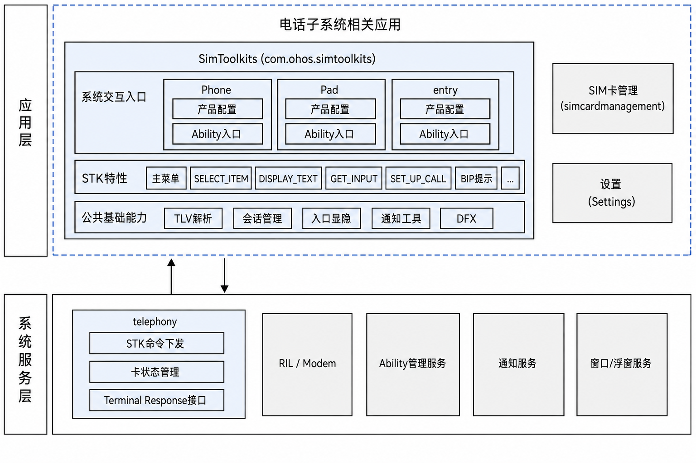
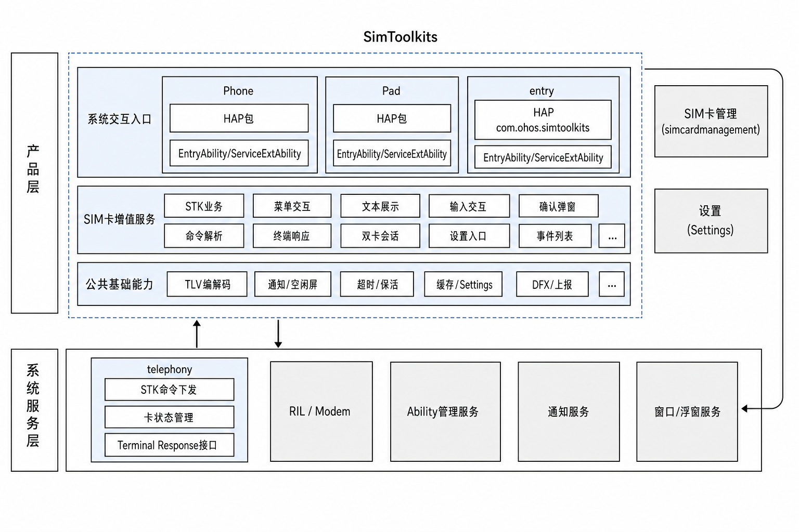
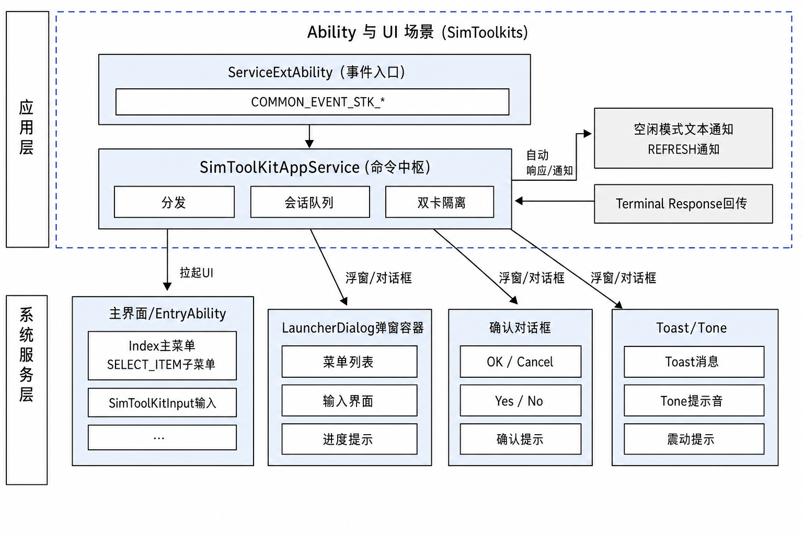
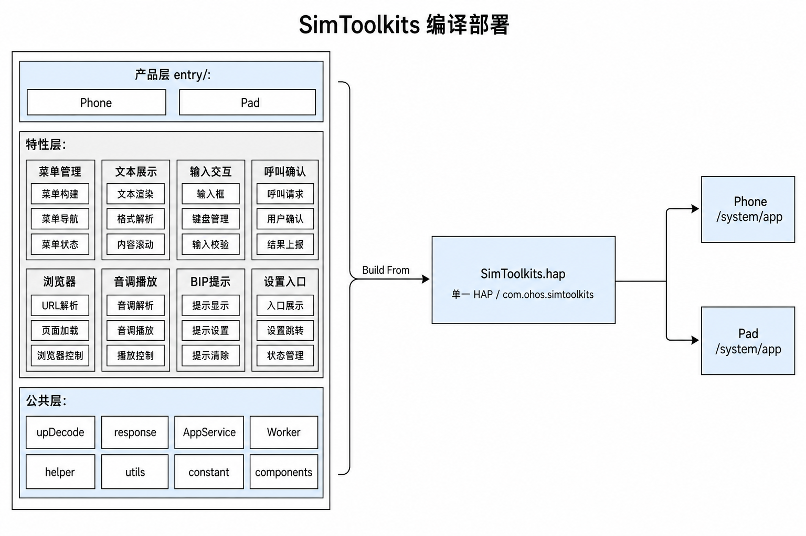

# SimToolkits

## 简介
**SimToolkits**（包名：`com.ohos.simtoolkits`）是 OpenHarmony 电话子系统中的 **SIM Toolkit（STK）系统应用**，负责解析并处理 SIM 卡下发的主动式命令（Proactive Command），向用户展示菜单、文本、输入框、确认对话框等交互界面，并将用户操作结果以 Terminal Response / Envelope 形式回传给 Telephony 框架。

本应用为系统预置应用，支持单卡 / 双卡 / eSIM 场景，通常不在桌面显示图标，用户可通过「设置 → 移动网络 → SIM 卡管理」等入口进入 STK 主菜单。

### 核心能力

**STK 命令解析与会话管理**
- 通过 `ServiceExtensionAbility` 接收 Telephony 下发的 STK 公共事件（命令、会话结束、卡状态变化、Alpha Identifier 等）。
- 在 Worker 线程中完成 HEX 命令的 BER-TLV 解码，由 `SimToolKitAppService` 按命令类型分发处理。
- 按 `slotId` 隔离会话状态，支持双卡并发场景下的命令队列与超时控制。

**用户交互 UI**
- 主菜单 / `SELECT_ITEM` 列表页（`Index`）。
- `GET_INKEY` / `GET_INPUT` 输入页（`SimToolKitInput`）。
- `DISPLAY_TEXT`、`SET_UP_CALL`、`LAUNCH_BROWSER`、`PLAY_TONE`、`OPEN_CHANNEL` 等统一弹窗（`LauncherDialog`）。
- 空闲模式文本、REFRESH 等通过通知栏展示。

**设置入口与双卡管理联动**
- 收到 `SET_UP_MENU` 后，通过 `EntranceHelper` 写入 Settings 并发布 `stk_entrance` 事件，控制设置搜索项中「SIM 卡应用服务」入口的显隐。
- 支持由 `com.ohos.simcardmanagement` 携带 `slotId` 启动主菜单。

**终端响应回传**
- 通过 TelephonyKit 的 `sim.sendTerminalResponseCmd` / `sim.sendEnvelopeCmd` 回传结果。
- 对 `SET_UP_CALL` 通过 `sim.acceptCallSetupRequest` / `sim.rejectCallSetupRequest` 完成用户确认。

> **说明**：本仓定位为 STK **应用层**。Modem / RIL 侧实际执行短信、补充业务、USSD、DTMF 等操作；本应用对部分命令（如 `SEND_SMS`、`SEND_SS`、`SEND_USSD`、`SEND_DTMF`、`REFRESH`）主要负责 Alpha ID 提示展示，Terminal Response 由底层完成。

### 支持的主动式命令

| 命令 | 类型值 | 应用侧处理概要 |
| ---- | ------ | -------------- |
| SET_UP_MENU | 0x25 | 缓存主菜单，刷新设置入口，回传 OK |
| SELECT_ITEM | 0x24 | 展示子菜单，用户选择后回传 |
| DISPLAY_TEXT | 0x21 | 弹窗 / Toast / 通知展示文本 |
| GET_INKEY | 0x22 | 单字符或 Yes/No 输入 |
| GET_INPUT | 0x23 | 文本输入 |
| SET_UP_IDLE_MODE_TEXT | 0x28 | 空闲模式文本（通知栏） |
| PROVIDE_LOCAL_INFORMATION | 0x26 | 日期时间、语言等信息自动回传 |
| SEND_SMS / SEND_SS / SEND_USSD / SEND_DTMF | 0x13 / 0x11 / 0x12 / 0x14 | Alpha ID Toast 提示（执行在 RIL） |
| REFRESH | 0x01 | 通知提示（执行在 RIL） |
| SET_UP_CALL | 0x10 | 确认对话框后接受 / 拒绝呼叫建立 |
| LAUNCH_BROWSER | 0x15 | 确认后启动浏览器 |
| PLAY_TONE | 0x20 | 播放提示音，可选带文本弹窗 |
| SET_UP_EVENT_LIST | 0x05 | 注册空闲屏、用户活动、语言等事件 |
| LANGUAGE_NOTIFICATION | 0x35 | 切换系统语言 |
| OPEN_CHANNEL / CLOSE_CHANNEL / RECEIVE_DATA / SEND_DATA / GET_CHANNEL_STATUS | 0x40–0x44 | BIP 相关（应用侧以确认 / 提示为主） |

### SimToolKits 与 Telephony 的关系

SimToolKits 依赖电话子系统（Telephony / RIL），本身不包含 Modem 协议栈实现。

**事件与调用关系上**：
1. Telephony 框架在收到 SIM 主动式命令后，通过 `startServiceExtensionAbility` 拉起本应用的 `ServiceExtAbility`，并携带 `COMMON_EVENT_STK_*` action 及 `msgCmd`、`slotId` 等参数。
2. 本应用完成解析、UI 交互后，通过 TelephonyKit API 回传 Terminal Response / Envelope。
3. 设置入口显隐与 `com.ohos.settings`、`com.ohos.simcardmanagement` 协同完成。

> 例如，一次典型的 `SELECT_ITEM` 流程：
> - Telephony 将命令 HEX 下发给 `ServiceExtAbility`；
> - `SimToolKitAppService` 经 Worker 解码后启动 `EntryAbility` 展示菜单；
> - 用户选择菜单项后，编码 Envelope / Terminal Response 并调用 `sim.sendTerminalResponseCmd` 回传。

## 架构说明

SimToolKits 采用分层与模块化设计，并与电话子系统协同工作。

### 在系统中的定位

SimToolKits 位于应用层，依赖 Telephony / RIL 下发主动式命令并回传 Terminal Response，同时与设置、SIM 卡管理应用协同完成入口显隐与双卡启动。



### 分层设计

整体可划分为产品层（Ability 入口）、特性层（STK 业务能力）、公共层（编解码 / 工具），如图：



| 层次 | 主要目录 / 组件 | 说明 |
| ---- | --------------- | ---- |
| 产品层 / 应用入口 | `application/`、`entryability/`、`ServiceExtAbility/` | AbilityStage、UIAbility、ServiceExtensionAbility 生命周期与事件接入 |
| 特性层 / STK 业务 | `pages/`、`model/SimToolKitAppService.ets` 等 | 菜单、输入、弹窗交互；命令分发、会话队列、双卡隔离 |
| 公共层 / 基础能力 | `model/upDecode/`、`model/responseData/`、`common/`、`workers/` | TLV 编解码、响应编码、入口显隐、通知、超时、缓存、上报 |

### Ability 与 UI 场景

事件由 `ServiceExtAbility` 接入，经 `SimToolKitAppService` 分发后，拉起菜单 / 输入页 / 弹窗，或走通知与自动响应路径：



**数据流概览**：

```text
SIM / Modem
  → Telephony / RIL
  → ServiceExtAbility (COMMON_EVENT_STK_*)
  → SimToolKitAppService
  → WorkerManager + UpDecodeFactory
  → UI (Index / Input / LauncherDialog) 或自动响应
  → SimToolKitResponseManager
  → sim.sendTerminalResponseCmd / sendEnvelopeCmd
```

### 部件与外部依赖

部件内部按产品 / 特性 / 公共能力组织，通过 TelephonyKit API、Settings、SIM 卡管理完成跨进程协作：


### 模块说明

| 模块 | 路径 | 说明 |
| ---- | ---- | ---- |
| AbilityStage | entry/src/main/ets/application/ | 应用级生命周期，监听语言 / 主题 / 字体缩放等配置变更 |
| EntryAbility | entry/src/main/ets/entryability/ | UI 入口，加载菜单 / 输入页，校验 SIM 状态与主菜单 |
| ServiceExtAbility | entry/src/main/ets/ServiceExtAbility/ | 后台服务，接收 STK 事件并创建浮窗 / 对话框 |
| 命令中枢 | entry/src/main/ets/model/SimToolKitAppService.ets | 核心单例，会话与命令分发 |
| 响应管理 | entry/src/main/ets/model/SimToolKitResponseManager.ets | Terminal Response / Envelope 发送 |
| TLV 解析 | entry/src/main/ets/model/upDecode/ | 各命令 Param 与 UpDecodeFactory |
| 响应编码 | entry/src/main/ets/model/responseData/ | Default / Input / SelectItem / BIP / Envelope 等 |
| Worker | entry/src/main/ets/workers/ | 异步解析 STK HEX 命令 |
| 页面 | entry/src/main/ets/pages/ | Index、SimToolKitInput、LauncherDialog |
| 公共组件 | entry/src/main/ets/common/components/ | NavBack、ToastDialog、ToneDialog |
| 辅助 Helper | entry/src/main/ets/common/helper/ | 入口、超时、空闲屏、事件列表、Settings 等 |
| 工具类 | entry/src/main/ets/common/utils/ | UI、通知、编码、缓存、上报、后台保活等 |
| 常量 | entry/src/main/ets/common/constant/ | 命令类型、响应码、超时、SlotId 等 |

## 编译构建

本工程按「产品层 / 特性层 / 公共层」组织源码，三层均位于单一 `entry` 模块内，编译后统一产出 `SimToolkits.hap`，部署到设备 `/system/app`。



当前以单一 `entry` HAP（`com.ohos.simtoolkits` / `SimToolkits.hap`）交付；上图左侧分层仅用于说明源码职责边界，构建产物只有 HAP。

### 环境要求
- OpenHarmony （本工程 `compileSdkVersion` 为 23，`compatibleSdkVersion` / `targetSdkVersion` 为 20）
- DevEco Studio 或命令行 Hvigor 工具链
- 系统签名证书（见 `signature/`）

### 编译命令

在工程根目录执行：

```bash
# 使用 DevEco Studio 打开工程后执行 Build，或使用 hvigor 命令行
hvigorw assembleHap
```

若作为 OpenHarmony 系统部件合入源码树，可参考平台统一构建方式，将本应用作为预置系统应用打包进镜像。

### 系统集成相关配置

系统镜像集成时通常还需配置（示例文件位于工程根目录）：

| 文件 | 说明 |
| ---- | ---- |
| install_list_permissions.json | 为 `com.ohos.simtoolkits` 预授 `SET_TELEPHONY_STATE`、`MANAGE_SECURE_SETTINGS` 等权限 |
| install_list_capability.json | 声明 `allowAppDesktopIconHide`、`allowAppUsePrivilegeExtension` 等系统能力 |

> 上述 install_list 配置需与系统侧权限 / 能力白名单仓协同维护，合入目标以实际产品合入规范为准。

## SimToolKits 开发

SimToolKits 采用 **ArkTS** 语言开发，UI 基于 ArkUI Stage 模型。Telephony 通过 Want 拉起 `ServiceExtAbility` 下发 STK 命令（命令、会话结束、卡状态变化等），由 `SimToolKitAppService` 完成解析与分发；菜单 / 输入类交互启动 `EntryAbility` 加载 `Index`、`SimToolKitInput`，确认框 / Toast / 音调等由 `ServiceExtAbility` 直接拉起 `LauncherDialog`，空闲文本、REFRESH 等走通知栏。可开发参考：[ArkUI 开发概述](https://gitcode.com/openharmony/docs/blob/master/zh-cn/application-dev/ui/arkts-ui-development-overview.md)

### 基于已有模块的开发

适用场景：对已有能力做功能定制，例如裁剪/调整既有 STK 命令处理、修改 UI 交互、调整设置入口显隐逻辑等。

**对已有模块的功能调整与裁剪**

1. 明确改动落点：按业务边界定位到 `model/`（命令分发与编解码）、`pages/`（UI）、`common/helper/`（入口 / 超时 / 空闲屏）或 `workers/`（异步解析）。
2. 调整命令处理时：
    - 命令类型定义位于 `entry/src/main/ets/common/constant/SimToolKitConstant.ts` 的 `CommandType`。
    - 解析类位于 `entry/src/main/ets/model/upDecode/`，并由 `UpDecodeFactory` 统一创建。
    - 分发与会话逻辑位于 `SimToolKitAppService`；响应编码位于 `model/responseData/`。

举例：查看 / 调整命令类型与解析注册：

```typescript
// common/constant/SimToolKitConstant.ts
export enum CommandType {
  SET_UP_MENU = 0x25,
  DISPLAY_TEXT = 0x21,
  SELECT_ITEM = 0x24,
  // ...
}

// model/upDecode/UpDecodeFactory.ets — 按 commandType 创建 Param
private createUpParams(commandType: number): BaseUpParams | undefined {
  switch (commandType) {
    case CommandType.SET_UP_MENU:
      return new SetUpMenuParam();
    case CommandType.DISPLAY_TEXT:
      return new DisplayTextParam();
    // 调整已有命令时，在此修改对应 Param 类或分支
    default:
      return this.createUpParamsSecondary(commandType);
  }
}
```

举例：在命令中枢按类型分发处理：

```typescript
// model/SimToolKitAppService.ets — handleUpParamData / handleUpParamDataSecondary
switch (upParams.commandType) {
  case CommandType.DISPLAY_TEXT:
    DisplayAndIdleTextHelper.getInstance(slotId)?.parseDisplayText(upParams as DisplayTextParam);
    break;
  case CommandType.SELECT_ITEM:
    this.startInputOrMenuAbility(upParams.slotId, upParams, PageUrl.PAGE_URL_MAIN);
    break;
  case CommandType.GET_INPUT:
  case CommandType.GET_INKEY:
    this.startInputOrMenuAbility(upParams.slotId, upParams, PageUrl.PAGE_URL_INPUT);
    break;
  // 调整已有命令时，修改对应分支逻辑即可
}
```

3. 裁剪某类命令时：
    - 先在 `UpDecodeFactory` / `SimToolKitAppService` 中移除对应分支；
    - 再清理 Param / Response 相关类与测试用例，避免残留调用。

举例：裁剪 `PLAY_TONE`（示意）：

```typescript
// UpDecodeFactory.createUpParams — 删除或注释对应 case
// case CommandType.PLAY_TONE:
//   result = new PlayToneParam();
//   break;

// SimToolKitAppService.handleUpParamDataSecondary — 删除对应分支
// case CommandType.PLAY_TONE:
//   this.parsePlayTone(upParams as PlayToneParam);
//   break;

// 同步删除 PlayToneParam / 相关 Response 编码与 ohosTest 用例
```

**对已有 UI 进行修改**

以定制 STK 交互界面举例：
- 事件入口为 `ServiceExtAbility`，UI 主入口为 `EntryAbility`，弹窗由 `ServiceExtAbility` 拉起 `LauncherDialog`。
- 主菜单 / 子菜单由 `pages/Index.ets` 承载；输入类命令由 `pages/SimToolKitInput.ets` 承载；确认框 / Toast / 音调由 `pages/LauncherDialog.ets` 及 `common/components/` 承载。
- 开发过程中可在既有页面中扩展组件，或按命令类型增加新的展示分支。

**举例：定制主菜单列表（`Index`）**

在菜单项渲染处可增加自定义标题、图标或点击逻辑：

```typescript
// pages/Index.ets — 主菜单 / SELECT_ITEM 列表
build() {
  Column() {
    NavBack({
      headName: this.title,
      menuItems: $menuItems,
      isShowMenu: $isShowMenu,
      callBack: (type: NavCallBackType) => {
        this.toolBarClick(type);
      }
    })
    List() {
      ForEach(this.menuList, (item: ItemContent, index?: number) => {
        ListItem() {
          Flex({ alignItems: ItemAlign.Center, justifyContent: FlexAlign.SpaceBetween }) {
            // 可在此扩展：自定义图标、角标、辅助说明等
            Text(item.itemText)
              .fontSize($r('app.float.font_16'))
              .fontWeight(FontWeight.Medium)
            SymbolGlyph($r('sys.symbol.chevron_right'))
              .fontColor([$r('sys.color.icon_secondary')])
          }
          .onClick(() => {
            // 默认：回传菜单选择；可在此插入定制前置逻辑
            this.menuItemClick(item.itemId);
          })
        }
      })
    }
  }
}
```

**举例：定制弹窗组合（`LauncherDialog`）**

按命令类型选择确认框 / Toast / Tone，并可插入自定义内容：

```typescript
// pages/LauncherDialog.ets — 按 dialog 类型组合已有组件
@Entry
@Component
struct LauncherDialog {
  @State private title: string = '';
  @State private content: string = '';
  private curDialog?: CustomDialogController;
  private curDialogType: string = '';

  private createConfirmDialogController(): CustomDialogController {
    return new CustomDialogController({
      builder: AlertDialog({
        primaryTitle: this.title,
        content: this.content,
        primaryButton: {
          value: $r('app.string.cancel'),
          action: () => {
            this.onEvent?.(UIResponseCode.RESPONSE_TYPE_CONFIRM_REJECT);
          }
        },
        secondaryButton: {
          value: $r('app.string.confirm'),
          action: () => {
            this.onEvent?.(UIResponseCode.RESPONSE_TYPE_CONFIRM_OK);
          }
        }
      })
    });
  }

  build() {
    // 按 curDialogType 分支：
    // dialog_type_confirm → AlertDialog / 确认框
    // dialog_type_toast   → ToastDialog
    // dialog_type_tone    → ToneDialog
    // 也可在此插入 CustomDialogContent(...) 做产品定制
  }
}
```

**举例：定制输入页（`SimToolKitInput`）**

`GET_INKEY` / `GET_INPUT` 的校验、默认文案、Yes/No 布局等均可在该页调整；确认后通过 `SimToolKitAppService.handleCmdResponse` 回传结果。

```typescript
// pages/SimToolKitInput.ets — 用户确认 / 取消后回传
private handleCommandResponse(isConfirm: boolean, input: string, isHelper: boolean): void {
  let inputResponseData = new UiInputResponseData(isConfirm, input, isHelper);
  SimToolKitAppService.getInstance().handleCmdResponse(
    FromPageFlag.TYPE_INPUT,
    UIResponseCode.RESPONSE_TYPE_INPUT,
    this.inkeyInputParam,
    undefined,
    inputResponseData
  );
}

private buttonClick(isConfirm: boolean, input: string): void {
  if (this.status === InkeyInputStatus.STATE_TEXT) {
    if (isConfirm) {
      // 可在此插入：自定义长度校验、脱敏、默认文案改写等
      this.handleCommandResponse(true, input, false);
    } else {
      SimToolKitAppService.getInstance().handleCmdResponse(
        FromPageFlag.TYPE_INPUT,
        UIResponseCode.RESPONSE_TYPE_END_SESSION,
        this.inkeyInputParam
      );
    }
  } else {
    // Yes / No 模式
    this.handleCommandResponse(isConfirm, '', false);
  }
}
```

常用修改入口：

| 目标 | 路径 |
| ---- | ---- |
| 菜单 / 子菜单 | `pages/Index.ets` |
| GET_INKEY / GET_INPUT | `pages/SimToolKitInput.ets` |
| 确认框 / Toast / 音调 | `pages/LauncherDialog.ets`、`common/components/` |
| 设置入口显隐 | `common/helper/EntranceHelper.ets` |

设置入口控制集中在 `EntranceHelper`：
- 按单卡 / 双卡 / eSIM 组合写入不同的 `stk_entrance*` Settings 键；
- 通过 RPC 调用 `com.ohos.settings` 的 `SettingsExtService` 启用 / 禁用搜索项。

```typescript
// common/helper/EntranceHelper.ets — SET_UP_MENU 后刷新设置入口
public async checkIsHaveMainMenu(
  context: common.ServiceExtensionContext | undefined,
  slotId: number
): Promise<void> {
  if (!context) {
    return;
  }
  // 有主菜单缓存则显示入口，否则隐藏
  let isHaveMainMenu =
    !CommonUtils.isEmptyObj(UpParamsCacheUtils.getInstance().getMainMenuParamsMemory(slotId));
  let key = this.getSettingDataKey(slotId);           // stk_entrance / stk_entrance_0 ...
  let value = this.getSaveSettingDataValue(slotId, isHaveMainMenu); // '0' 隐藏 / '1'|'2'|'31' 显示
  await settings.setValue(context, key, value);
  // 再 publish stk_entrance 事件，并 RPC enableSearchItems / disableSearchItems
}
```

### 新特性或命令能力的开发

适用场景：新增 Proactive Command 支持、扩展设备形态、补充差异化交互能力。

> **说明**：当前工程为单一 `entry` HAP（`com.ohos.simtoolkits`），不像 SceneBoard 按 Phone/Pad/PC 拆多产品 HAP。新能力一般在现有 HAP 内按模块扩展；若后续拆分产品形态，可再参考本节配置方式新增 HAP。

**步骤1：扩展命令解析与分发（最常见）**

1. 在 `SimToolKitConstant.ts` 的 `CommandType` 中补充命令类型（如已存在则跳过）。

```typescript
// common/constant/SimToolKitConstant.ts
export enum CommandType {
  // ... 已有命令
  CUSTOM_CMD = 0xXX, // 新增命令类型值（以 3GPP / 产品规格为准）
}
```

2. 在 `model/upDecode/` 中新增或扩展对应 Param 解析类，并在 `UpDecodeFactory` 中注册。

```typescript
// model/upDecode/CustomCmdParam.ets — 新增解析类示意
export class CustomCmdParam extends BaseUpParams {
  public text: string = '';

  public processMsgList(tlvList: Array<Tlv>): void {
    super.processMsgList(tlvList);
    if (this.parseResultCode === ResponseCode.OK) {
      let parseText = DecodeItemUtil.parseTextString(tlvList).data;
      if (parseText === undefined) {
        this.parseResultCode = ResponseCode.CMD_DATA_NOT_UNDERSTOOD;
      } else {
        this.text = parseText;
      }
    }
  }
}

// model/upDecode/UpDecodeFactory.ets — 注册
case CommandType.CUSTOM_CMD:
  result = new CustomCmdParam();
  break;
```

3. 在 `SimToolKitAppService` 的分发逻辑中增加处理分支（拉起 UI 或自动响应）。

```typescript
// model/SimToolKitAppService.ets
case CommandType.CUSTOM_CMD:
  // 需要用户交互：拉起菜单 / 输入 / 弹窗页
  this.startInputOrMenuAbility(upParams.slotId, upParams, PageUrl.PAGE_URL_DIALOG);
  // 或无需交互：直接 showToast / 发 Terminal Response 后拉下一条
  break;
```

4. 如需回传专用结果，在 `model/responseData/` 中补充 Response / Envelope 编码。

```typescript
// model/responseData/terminalResponseData/CustomCmdResponseData.ets — 示意
export class CustomCmdResponseData extends DefaultResponseData {
  // 在 getCmdDetail() / 编码方法中按 TLV 追加专用字段
  // 最终由 SimToolKitResponseManager 调用
  // sim.sendTerminalResponseCmd(slotId, responseHex)
}
```

5. 在 `entry/src/ohosTest` 中补充对齐 3GPP TS 27.22 的解析与响应单测。

```typescript
// entry/src/ohosTest/.../CustomCmd.test.ets — 示意
it('CustomCmd_parse', 0, async (done: Function) => {
  const HEX = 'D0...'; // 标准或厂商提供的命令 HEX
  let upParam = UpDecodeFactory.getInstance().parseUpData(HEX, 0);
  expect(upParam?.commandType).assertEqual(CommandType.CUSTOM_CMD);
  expect((upParam as CustomCmdParam)?.text).assertEqual('expected');
  done();
});
```

**步骤2：配置 / 确认 Ability 入口**

本工程入口已在 `entry/src/main/module.json5` 中声明，扩展能力时通常只需确认权限与 Ability 配置是否满足新场景：

```json
{
  "module": {
    "name": "entry",
    "type": "entry",
    "srcEntry": "./ets/application/SimToolKitApplication.ets",
    "mainElement": "EntryAbility",
    "deviceTypes": [
      "default",
      "tablet"
    ],
    "abilities": [
      {
        "name": "EntryAbility",
        "srcEntry": "./ets/entryability/EntryAbility.ets",
        "exported": true,
        "launchType": "singleton"
      }
    ],
    "extensionAbilities": [
      {
        "name": "ServiceExtAbility",
        "srcEntry": "./ets/ServiceExtAbility/ServiceExtAbility.ets",
        "type": "service",
        "exported": true
      }
    ]
  }
}
```

事件入口（`ServiceExtAbility`）典型处理：

```typescript
// ServiceExtAbility：接收 Telephony 下发的 STK 事件
export default class ServiceExtAbility extends ServiceExtensionAbility {
  onCreate(want: Want): void {
    SimToolKitAppService.getInstance().setServiceContext(this.context);
  }

  onRequest(want: Want, startId: number): void {
    // 拉起弹窗（如需要）
    // this.checkIsShowDialog(want);
    // 分发到命令中枢
    if (want?.action) {
      SimToolKitAppService.getInstance().callBackFromService(want.parameters, want.action);
    }
  }
}
```

**步骤3：定制 UI**

在完成命令解析与 Ability 配置后，按上一节「对已有 UI 进行修改」扩展 `Index` / `SimToolKitInput` / `LauncherDialog` 等页面即可。

若需新增独立页面：
1. 在 `pages/` 下新增页面文件，例如 `pages/CustomStkPage.ets`；

```typescript
// pages/CustomStkPage.ets — 新页面骨架示意
@Entry
@Component
struct CustomStkPage {
  @State private title: string = '';
  @State private content: string = '';

  aboutToAppear() {
    // 从 AppStorage / LocalStorage 读取当前命令 Param 并渲染
  }

  build() {
    Column() {
      Text(this.title)
      Text(this.content)
      Button($r('app.string.confirm'))
        .onClick(() => {
          SimToolKitAppService.getInstance().handleCmdResponse(
            FromPageFlag.TYPE_DIALOG,
            UIResponseCode.RESPONSE_TYPE_CONFIRM_OK
          );
        })
    }
  }
}
```

2. 在 `resources/base/profile/main_pages.json` 中注册：

```json
{
  "src": [
    "pages/Index",
    "pages/SimToolKitInput",
    "pages/LauncherDialog",
    "pages/CustomStkPage"
  ]
}
```

3. 在 `Constants.ts` 补充 `PageUrl`，并由 `SimToolKitAppService` / `EntryAbility` 按命令类型拉起：

```typescript
// common/constant/Constants.ts
export enum PageUrl {
  PAGE_URL_INPUT = 'pages/SimToolKitInput',
  PAGE_URL_MAIN = 'pages/Index',
  PAGE_URL_DIALOG = 'pages/LauncherDialog',
  PAGE_URL_CUSTOM = 'pages/CustomStkPage', // 新增
}

// model/SimToolKitAppService.ets — 分发时指定 pageUrl
case CommandType.CUSTOM_CMD:
  this.startInputOrMenuAbility(upParams.slotId, upParams, PageUrl.PAGE_URL_CUSTOM);
  break;

// entryability/EntryAbility.ets — 按 want.parameters.pageUrl 加载
private getPageUrl(want: Want): string {
  if (!want.parameters?.pageUrl || (typeof want.parameters?.pageUrl) !== 'string') {
    return PageUrl.PAGE_URL_MAIN;
  }
  return want.parameters.pageUrl as string;
}
```

## 目录
```text
simtoolkits
├─AppScope                              # 应用级配置与多语言资源
│  ├─app.json5                          # bundleName、版本号等
│  └─resources/                         # 全局 string 等资源
├─docs
│  └─figures/                           # 架构图
│     ├─simtoolkits_in_os.png           # 系统中定位（中文）
│     ├─simtoolkits_architecture.png    # 分层架构（中文）
│     ├─simtoolkits_ability.png         # Ability 与 UI 场景（中文）
│     ├─simtoolkits_ipc.png             # 部件与外部依赖（中文）
│     ├─simtoolkits_build.png           # 编译部署（中文）
│     ├─simtoolkits_in_os_en.png        # 系统中定位（英文）
│     ├─simtoolkits_architecture_en.png # 分层架构（英文）
│     ├─simtoolkits_ability_en.png      # Ability 与 UI 场景（英文）
│     ├─simtoolkits_ipc_en.png          # 部件与外部依赖（英文）
│     └─simtoolkits_build_en.png        # 编译部署（英文）
├─entry                                 # 唯一 HAP 模块
│  ├─src/main/
│  │  ├─ets/
│  │  │  ├─application/                 # AbilityStage
│  │  │  ├─entryability/                # EntryAbility（UI 入口）
│  │  │  ├─ServiceExtAbility/           # ServiceExtensionAbility（事件入口）
│  │  │  ├─model/                       # 业务中枢、TLV 解析、响应编码
│  │  │  │  ├─upDecode/                 # 主动式命令解析
│  │  │  │  └─responseData/             # Terminal Response / Envelope
│  │  │  ├─pages/                       # Index / Input / LauncherDialog
│  │  │  ├─common/
│  │  │  │  ├─components/               # 公共 UI 组件
│  │  │  │  ├─constant/                 # 命令类型、常量
│  │  │  │  ├─helper/                   # 入口、超时、空闲屏等 Helper
│  │  │  │  └─utils/                    # 工具类
│  │  │  └─workers/                     # Worker 异步解析
│  │  ├─resources/                      # 模块资源、多语言、深色模式等
│  │  └─module.json5                    # Ability、权限声明
│  ├─src/mock/                          # 单元测试 mock（telephony.sim 等）
│  ├─src/ohosTest/                      # Hypium 自动化测试
│  ├─build-profile.json5
│  └─obfuscation-rules.txt
├─hvigor                                # 构建工具配置
├─signature                             # 签名证书与 profile
├─install_list_capability.json          # 系统能力白名单示例
├─install_list_permissions.json         # 系统预授权示例
├─build-profile.json5                   # 工程级 SDK / 签名 / product 配置
├─oh-package.json5
├─OAT.xml                               # 开源合规审计
├─LICENSE
├─README.md
└─README_en.md
```

## 约束
- 语言版本：ArkTS
- 运行形态：系统预置应用（`com.ohos.simtoolkits`），依赖 TelephonyKit 及系统特权权限
- 设备类型：`default`、`tablet`（见 `module.json5`）
- 双卡：按 `slotId`（0 / 1）隔离；eSIM 组合依赖系统参数 `const.ril.esim_type`、`persist.ril.sim_switch`
- 子用户：非主 OS 账户（`localId ≠ 100`）除 `SET_UP_MENU` 外，其余命令按当前策略拒绝处理
- 本仓不包含 RIL / Modem 源码；不直接订阅 STK 广播，依赖 Telephony 主动拉起 `ServiceExtAbility`

## 参与贡献

欢迎广大开发者贡献代码、文档等，具体的贡献流程和方式请参见[参与贡献](https://gitcode.com/openharmony/docs/blob/master/zh-cn/contribute/%E5%8F%82%E4%B8%8E%E8%B4%A1%E7%8C%AE.md)。

## 相关仓
- [telephony_core_service](https://gitcode.com/openharmony/telephony_core_service)（Telephony 核心服务，按实际合入仓调整链接）
- [telephony_ril_adapter](https://gitcode.com/openharmony/telephony_ril_adapter)（RIL 适配，按实际合入仓调整链接）
- Settings / SIM 卡管理相关系统应用（`com.ohos.settings`、`com.ohos.simcardmanagement`）
