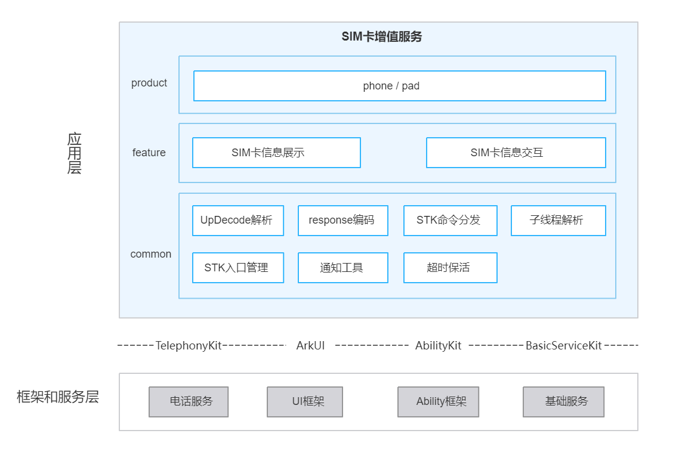

# SIM卡增值服务(SimToolKits)

## 简介

SimToolKits（STK，包名：com.ohos.simtoolkits）是 OpenHarmony 电话子系统中预置的**SIM卡增值服务系统应用**，负责解析并处理 SIM 卡下发的主动式命令（Proactive Command），向用户展示菜单、文本、输入框、确认对话框等交互界面，并将用户操作结果以 Terminal Response / Envelope 形式回传给 Telephony 框架。

本应用为系统预置应用，支持单卡 / 双卡 / eSIM 场景，通常不在桌面显示图标，用户可通过「设置 → 移动网络 → SIM 卡管理 → SIM 应用程序」入口进入 STK 主菜单。

### 核心能力

**SIM卡信息展示**

- 支持展示 SIM 下发文本、空闲模式文本或刷新提示
- 支持播放提示音，并可选伴随文本弹窗
- 支持 BIP确认 / 提示
- 支持按 SIM 下发语言通知切换系统语言

**SIM卡信息交互**

- 支持主菜单与子菜单的展示、选择与回传
- 支持单字符 / 多字符输入与回传
- 支持呼叫建立确认（接受 / 拒绝）
- 支持确认后拉起系统浏览器
- 支持在设置中显隐 STK 应用程序入口

### 术语说明

| 术语 | 全称 / 英文 | 说明                                                                                                                                                                            |
| ---- | ----------- |-------------------------------------------------------------------------------------------------------------------------------------------------------------------------------|
| Proactive Command | 主动式命令 | SIM 卡主动下发给终端的业务指令（如建菜单、显文本、取输入、BIP 开通道等），由本应用解析并驱动 UI                                                                                                                         |
| Terminal Response | 终端响应 | 终端将命令执行结果（成功 / 失败 / 用户取消等）回传给 SIM 卡的报文                                                                                                                                        |
| Envelope | 信封 | 终端主动上报给 SIM 卡的事件或用户选择（如菜单项选择），与 Terminal Response 配合完成会话                                                                                                                      |
| BIP | Bearer Independent Protocol（承载无关协议） | STK 中与承载无关的数据通道能力，定义见 3GPP TS 31.124 V14.3.0；含 `OPEN_CHANNEL`、`CLOSE_CHANNEL`、`RECEIVE_DATA`、`SEND_DATA`、`GET_CHANNEL_STATUS` 等。本应用侧主要做弹窗 确认/提示，实际建链与收发在 Modem / RIL |
| TLV | Tag-Length-Value | STK 命令与响应的二进制编码结构；公共层 `upDecode` / `responseData` 负责解析与编码                                                                                                                     |

## 架构说明

SimToolKits 采用分层与模块化设计，按产品形态、业务特性与公共能力组织代码，并与电话子系统协同工作，如图：




### 应用层分层设计

整体可划分为产品层、特性层、公共层：

| 层次 | 主要目录 / 组件 | 说明                                                     |
| ---- | -------------- |--------------------------------------------------------|
| 产品层 | phone / pad | 支持手机、平板形态                                              |
| 特性层 | `pages`、`model/upDecode` | SIM卡信息展示、SIM卡信息交互                                      |
| 公共层 | `model/upDecode`、`model/responseData`、`model`（SimToolKitAppService）、`workers`、`common/helper`（EntranceHelper）、`common/utils`（NotificationUtils）、`common/helper`（CustTimeOutHelper） | UpDecode 解析、Response 编码、STK命令分发、子线程解析、STK入口管理、通知工具、超时保活 |

模块说明：

<table>
  <thead>
    <tr>
      <th>模块</th>
      <th>目录与关键类</th>
      <th>说明</th>
    </tr>
  </thead>
  <tbody>
    <tr>
      <td>phone / pad</td>
      <td><code>module.json5</code></td>
      <td>在 <code>module.json5</code> 声明手机与平板形态，共用同一套 STK 解析 / 分发 / 页面与 <code>entry</code> HAP</td>
    </tr>
    <tr>
      <td rowspan="4">SIM卡信息展示</td>
      <td><code>model/upDecode</code>（DisplayTextParam、SetUpIdleModeTextParam）</td>
      <td>支持展示 SIM 下发文本、空闲模式文本或刷新提示</td>
    </tr>
    <tr>
      <td><code>model/upDecode</code>（PlayToneParam）</td>
      <td>支持播放提示音，并可选伴随文本弹窗</td>
    </tr>
    <tr>
      <td><code>pages</code>（LauncherDialog）、<code>model/upDecode</code>（AllBipParam）</td>
      <td>支持 BIP 确认 / 提示</td>
    </tr>
    <tr>
      <td><code>model/upDecode</code>（LanguageNotificationHelper、LanguageNotificationParam）</td>
      <td>支持按 SIM 下发语言通知切换系统语言</td>
    </tr>
    <tr>
      <td rowspan="4">SIM卡信息交互</td>
      <td><code>pages</code>（Index）、<code>model/upDecode</code>（SetUpMenuParam、SelectItemParam）</td>
      <td>支持主菜单与子菜单的展示、选择与回传</td>
    </tr>
    <tr>
      <td><code>pages</code>（SimToolKitInput）、<code>model/upDecode</code>（GetInkeyInputParam）</td>
      <td>支持单字符 / 多字符输入与回传</td>
    </tr>
    <tr>
      <td><code>pages</code>（LauncherDialog）、<code>model/upDecode</code>（SetUpCallParam）</td>
      <td>支持呼叫建立确认</td>
    </tr>
    <tr>
      <td><code>pages</code>（LauncherDialog）、<code>model/upDecode</code>（LaunchBrowserParam）</td>
      <td>支持确认后拉起系统浏览器</td>
    </tr>
    <tr>
      <td>UpDecode解析</td>
      <td><code>model/upDecode</code>（UpDecodeFactory、各 Param）</td>
      <td>解析 SIM 下发的主动式命令 TLV，生成对应命令解析后的结构化数据对象 Param，供后续分发与 UI 展示使用</td>
    </tr>
    <tr>
      <td>response编码</td>
      <td><code>model/responseData</code></td>
      <td>编码 Terminal Response / Envelope，经 TelephonyKit 回传</td>
    </tr>
    <tr>
      <td>STK命令分发</td>
      <td><code>model</code>（SimToolKitAppService）</td>
      <td>按类型分发STK命令到页面 / 弹窗，并驱动回传</td>
    </tr>
    <tr>
      <td>子线程解析</td>
      <td><code>workers</code>、<code>common/components</code></td>
      <td>负责hex编码格式STK命令的异步解析等耗时任务</td>
    </tr>
    <tr>
      <td>STK入口管理</td>
      <td><code>common/helper</code>（EntranceHelper、SettingsDataHelper）</td>
      <td>支持在设置→移动网络→SIM卡管理中显隐 STK 应用程序入口</td>
    </tr>
    <tr>
      <td>通知工具</td>
      <td><code>common/utils</code>（NotificationUtils、UiUtils、UpParamsCacheUtils 等）、<code>common/constant</code>、<code>common/helper</code>（DisplayAndIdleTextHelper）</td>
      <td>STK 通用能力：通知、拉起 Ability / 浮窗、主菜单缓存、空闲屏文本、命令类型与响应码常量</td>
    </tr>
    <tr>
      <td>超时保活</td>
      <td><code>common/helper</code>（CustTimeOutHelper）</td>
      <td>STK 会话命令超时与后台保活，供展示 / 交互模块复用</td>
    </tr>
  </tbody>
</table>

### 与其它应用的关系

| 维度          | 说明                                                                                                                                                                                                                                                                                         |
|-------------|--------------------------------------------------------------------------------------------------------------------------------------------------------------------------------------------------------------------------------------------------------------------------------------------|
| 是否允许其它应用拉起  | 允许。`EntryAbility` / `ServiceExtAbility` 声明 `exported=true`，Telephony 等系统组件可通过 Want 拉起                                                                                                                                                                                                      |
| 拉起场景        | **场景 1（SIM 主动下发）**：应用预置安装后，SIM 卡下发主动式命令时，由 Telephony 框架拉起 `ServiceExtAbility`，携带 `action` / `msgCmd` / `slotId` 等下发 STK 事件并驱动交互。<br>**场景 2（用户从设置进入）**：用户在「设置→ 移动网络→  SIM 卡管理 → SIM 应用程序」入口进入时，由设置或 `com.ohos.simcardmanagement` 携带 `slotId`（及可选 `pageUrl`）拉起 `EntryAbility`，打开对应卡槽的 STK 主菜单。 |
| 支持的 Want 参数 | `action`（`COMMON_EVENT_STK_*`）、`msgCmd`、`slotId`、`pageUrl` 等（见 `ServiceExtAbility` / `EntryAbility`）                                                                                                                                                                                       |
| 跨进程协作       | 通过 TelephonyKit API 回传命令结果；通过 Settings / RPC 与 `com.ohos.settings`、`com.ohos.simcardmanagement` 协同完成设STK入口与双卡启动                                                                                                                                                                              |

## 编译构建

本工程源码按「产品层 / 特性层 / 公共层」组织，均位于单一 `entry` 模块内，使用 Hvigor 构建，产物为 `com.ohos.simtoolkits`（`SimToolkits.hap`）系统应用包。

### 环境要求

- OpenHarmony SDK：compileSdkVersion 26，compatibleSdkVersion 23，targetSdkVersion 23
- DevEco Studio 或命令行 Hvigor 工具链
- 系统签名证书（见 `signature/`）

### 编译命令

在工程根目录执行：

```bash
# 使用 DevEco Studio 打开工程后执行 Build，或使用 hvigor 命令行
hvigorw assembleHap
```

## SimToolKits 开发

SimToolKits 采用 ArkTS 语言开发，UI 基于 ArkUI Stage 模型。应用通过 `ServiceExtAbility` 接收 Telephony 下发的 STK 事件，由 `SimToolKitAppService` 完成解析与分发；菜单 / 输入类交互启动 `EntryAbility` 加载 `Index`、`SimToolKitInput`，确认框 / Toast / 音调等由 `ServiceExtAbility` 直接拉起 `LauncherDialog`。开发可参考：[ArkUI 开发概述](https://gitcode.com/openharmony/docs/blob/master/zh-cn/application-dev/ui/arkts-ui-development-overview.md)

### 基于已有模块的开发

适用场景：对已有能力做功能定制，例如裁剪 / 调整既有 STK 命令处理、修改 UI 交互、调整STK入口逻辑等。

对已有模块的功能修改与裁剪

**场景1：修改命令解析链路**

当 SIM 卡规范升级、不同运营商/卡商对同一命令的 TLV 实现存在差异，或需要在已有命令中解析新增的可选 Tag 时，需要修改命令解析链路。例如：

- `DISPLAY_TEXT` 新增了限定字要求按特定优先级展示；
- `SET_UP_MENU` 的菜单项需要额外携带图标标识或辅助说明字段；
- 某命令的非标准字段需要兼容解析，避免命令被丢弃。

修改点为 `UpDecodeFactory` 中对应命令分支，以及该命令 Param 类的 `processMsgList` 方法：

```typescript
// model/upDecode/UpDecodeFactory.ets — 按 commandType 创建 Param
private createUpParams(commandType: number): BaseUpParams | undefined {
  switch (commandType) {
    case CommandType.SET_UP_MENU:
      return new SetUpMenuParam();
    case CommandType.DISPLAY_TEXT:
      return new DisplayTextParam();
    // 调整已有命令时，在此修改对应 Param 类或分支
    default:
      return this.createUpParamsSecondary(commandType);
  }
}
```

**场景2：修改命令分发链路**

当产品希望调整某命令的交互形态、增加命令前置处理，或改变命令触发的页面/弹窗时，需要修改命令分发链路。例如：

- 将 `DISPLAY_TEXT` 从浮窗展示改为通知栏展示；
- 将 `SELECT_ITEM` 从全屏菜单改为弹窗快速选择；
- 收到某命令时需要先完成缓存、日志记录或权限校验，再决定是否拉起界面。

修改点为 `SimToolKitAppService.handleUpParamData` 中的分发分支，决定命令走弹窗、全屏页、Helper 处理或直接回传：

```typescript
// model/SimToolKitAppService.ets — handleUpParamData
switch (upParams.commandType) {
  case CommandType.DISPLAY_TEXT:
    DisplayAndIdleTextHelper.getInstance(slotId)?.parseDisplayText(upParams as DisplayTextParam);
    break;
  case CommandType.SELECT_ITEM:
    this.startInputOrMenuAbility(upParams.slotId, upParams, PageUrl.PAGE_URL_MAIN);
    break;
  case CommandType.GET_INPUT:
  case CommandType.GET_INKEY:
    this.startInputOrMenuAbility(upParams.slotId, upParams, PageUrl.PAGE_URL_INPUT);
    break;
  // 调整已有命令时，修改对应分支逻辑即可
}
```

**场景3：修改 STK 入口显隐**

当产品要求在不同条件下控制「设置 → 移动网络 → SIM卡管理 → SIM 应用程序」入口的可见性时，需要修改入口显隐逻辑。例如：

- 仅当某卡槽已缓存有效主菜单（`SET_UP_MENU`）时才显示入口；
- 双卡 / eSIM 场景下需要按卡槽区分入口文案或独立控制显隐；
- 定制设备上默认隐藏 STK 入口，或按运营商配置动态启用。

SIM 下发 / 清除主菜单后，会调用 `EntranceHelper.checkIsHaveMainMenu`：按该卡槽是否已有主菜单缓存，写入 Settings、发布 `stk_entrance` 事件，并 RPC 通知 `com.ohos.settings` 启用 / 禁用搜索入口。修改点为 `EntranceHelper`：

```typescript
// common/helper/EntranceHelper.ets — 按主菜单缓存刷新STK入口
public async checkIsHaveMainMenu(
  context: common.ServiceExtensionContext | undefined,
  slotId: number
): Promise<void> {
  if (!context) {
    return;
  }
  // 该卡槽是否已有 SET_UP_MENU 缓存的主菜单
  let isHaveMainMenu =
    !CommonUtils.isEmptyObj(UpParamsCacheUtils.getInstance().getMainMenuParamsMemory(slotId));
  let settingDataKey = this.getSettingDataKey(slotId);
  let settingDataValue = this.getSaveSettingDataValue(slotId, isHaveMainMenu);
  await settings.setValue(context, settingDataKey, settingDataValue);
  // 另写时间戳、publish('stk_entrance')，再 RPC enableSearchItems / disableSearchItems
}
```

**场景4：修改 UI 组件**

当产品需要进行运营商品牌定制、适配不同设备形态，或增强特定页面的交互体验时，需要修改 UI 组件。例如：

- 主菜单列表需要显示运营商品牌图标、角标或辅助说明；
- 输入页（`GET_INKEY` / `GET_INPUT`）需要增加密码可见性切换、输入格式提示；
- 确认框 / Toast 需要调整样式、按钮文案或增加风险提醒；
- 平板等大屏设备需要调整布局与字号。

以定制主菜单列表展示为例，直接修改 `pages/Index.ets`：

```typescript
// pages/Index.ets — 主菜单 / SELECT_ITEM 列表
List() {
  ForEach(this.menuList, (item: ItemContent, index?: number) => {
    ListItem() {
      Flex({ alignItems: ItemAlign.Center, justifyContent: FlexAlign.SpaceBetween }) {
        // 可在此扩展：自定义图标、角标、辅助说明等
        Text(item.itemText)
          .fontSize($r('app.float.font_16'))
          .fontWeight(FontWeight.Medium)
        SymbolGlyph($r('sys.symbol.chevron_right'))
          .fontColor([$r('sys.color.icon_secondary')])
      }
      .onClick(() => {
        this.menuItemClick(item.itemId);
      })
    }
  })
}
```

常用修改入口：

| 目标 | 路径 |
| ---- | ---- |
| 菜单 / 子菜单 | `entry/src/main/ets/pages/Index.ets` |
| GET_INKEY / GET_INPUT | `entry/src/main/ets/pages/SimToolKitInput.ets` |
| 确认框 / Toast / 音调 | `entry/src/main/ets/pages/LauncherDialog.ets`、`common/components/` |
| 命令中枢 | `entry/src/main/ets/model/SimToolKitAppService.ets` |
| STK入口 | `entry/src/main/ets/common/helper/EntranceHelper.ets` |
| 通用弹框 / 导航 | `entry/src/main/ets/common/components/` |

### 新特性能力的开发

适用场景：新增 Proactive Command 支持、扩展交互形态、补充差异化能力或适配新设备形态。

说明：当前工程为单一 `entry` HAP（`com.ohos.simtoolkits`），产品 / 特性 / 公共能力均在同一模块内按目录划分。新能力一般按现有分层扩展；若后续拆分产品形态 HAP，可再新增对应目录并在 `build-profile.json5` 中注册。

#### 以新增 Proactive Command 支持为例

以下以示例命令 `DEMO_CMD`（`0x7A`，非本仓已实现能力）说明新增一条 Proactive Command 所需的处理流程与关键入口。

处理链路：Telephony 下发命令 hex → `ServiceExtAbility` 接入 → `UpDecodeFactory` 解析为 Param → `SimToolKitAppService` 分发 → UI 呈现与用户操作 → `responseData` 编码 Terminal Response / Envelope → TelephonyKit 回传。

**步骤1：完成命令识别、解析、分发与回传**

目标：使应用能够识别 `DEMO_CMD`，完成 TLV 解析与命令分发，并按协议回传处理结果。

1）在 `CommandType` 中登记命令类型（须与 Modem / 卡侧下发的命令类型字节一致）：

```typescript
// common/constant/SimToolKitConstant.ts
export enum CommandType {
  // ...
  DEMO_CMD = 0x7A, // 示例命令
  // ...
}
```

2）新增 Param 解析类，并在 `UpDecodeFactory.createUpParams` 中注册；未注册时，`parseUpData` 无法构造 Param，命令将被丢弃：

```typescript
// model/upDecode/DemoCmdParam.ets（示例，需新建）
export class DemoCmdParam extends BaseUpParams {
  public processMsgList(tlvList: Array<Tlv>): void {
    super.processMsgList(tlvList);
    // 按协议解析本命令 TLV，写入 Param 字段
  }
}

// model/upDecode/UpDecodeFactory.ets
case CommandType.DEMO_CMD:
  result = new DemoCmdParam();
  break;
```

3）在 `SimToolKitAppService` 中增加分发分支，将 Param 导向对应 UI 入口（确认框走 `UiUtils.startDialog`，全屏页走 `startInputOrMenuAbility`）：

```typescript
// model/SimToolKitAppService.ets — handleUpParamDataSecondary
case CommandType.DEMO_CMD:
  // UiUtils.startDialog(this.uiContext, this.serviceContext, upParams);
  // 或：this.startInputOrMenuAbility(upParams.slotId, upParams, PageUrl.PAGE_URL_XXX);
  break;
```

4）通过 `SimToolKitResponseManager.sendTerminalResponseData`（BIP 场景使用 `sendBipResponseData`）完成编码与回传。一般命令可复用 `DefaultResponseData`；若需回传专用结果字段，再新增对应编码器。

5）在 `entry/src/ohosTest/ets/test/commandtype/` 补充用例，以命令 hex 驱动解析与 UI 验证，并在 `List.test.ets` 中注册。

**步骤2：核对 Ability 与权限配置**

步骤1已完成命令在业务层的解析、分发与回传逻辑。接下来需核对 `entry/src/main/module.json5` 中的 Ability 与权限声明，确保 Telephony 可将命令送达本应用，且本应用具备拉起 UI 与回传结果的权限。相关入口与权限本仓通常已具备，按新命令实际交互方式确认即可：

```json5
// entry/src/main/module.json5（节选）
{
  "module": {
    "mainElement": "EntryAbility",
    "pages": "$profile:main_pages",
    "abilities": [{
      "name": "EntryAbility",
      "srcEntry": "./ets/entryability/EntryAbility.ets",
      "exported": true,          // 全屏页入口
      "launchType": "singleton",
      "permissions": ["ohos.permission.SET_TELEPHONY_STATE"]
    }],
    "extensionAbilities": [{
      "name": "ServiceExtAbility",
      "srcEntry": "./ets/ServiceExtAbility/ServiceExtAbility.ets",
      "type": "service",
      "exported": true           // Telephony 下发 STK 事件的入口
    }],
    "requestPermissions": [
      "ohos.permission.SET_TELEPHONY_STATE",              // Terminal Response / Envelope 回传
      "ohos.permission.START_ABILITIES_FROM_BACKGROUND",  // 后台拉起 EntryAbility / 弹窗
      "ohos.permission.SYSTEM_FLOAT_WINDOW",              // LauncherDialog 浮窗
      "ohos.permission.KEEP_BACKGROUND_RUNNING"           // STK 会话保活
    ]
  }
}
```

| 交互方式 | 所需入口 / 权限 |
| -------- | --------------- |
| 确认框 / Toast | `ServiceExtAbility`、`SYSTEM_FLOAT_WINDOW`、回传权限 |
| 全屏页 | 另需 `EntryAbility`（`exported=true`）、`START_ABILITIES_FROM_BACKGROUND` |
| 回传处理结果 | `SET_TELEPHONY_STATE` |

**步骤3：完成 UI 侧接入**

步骤2已确认命令可进入应用且具备拉起界面与回传的权限。接下来需完成 UI 侧接入，使 Param 字段能够展示给用户，并将用户操作结果交回 `SimToolKitAppService` 完成回传：

- 确认框：在 `pages/LauncherDialog.ets` 增加 `CommandType.DEMO_CMD` 分支；通常无需修改 `main_pages.json`。
- 全屏页：新增页面并登记至 `resources/base/profile/main_pages.json`，在 `PageUrl` 中增加路由常量，分发时调用 `startInputOrMenuAbility(..., PageUrl.PAGE_URL_XXX)`。Want 需携带 `pageUrl`、`upParam`、`slotId`，供 `EntryAbility` 执行 `loadContent`。

## 目录

```text
simtoolkits
├─AppScope                              # STK 应用级配置与多语言文案
│  ├─app.json5                          # 应用包名、版本号
│  └─resources/                         # STK 全局字符串 / 图标等资源
├─docs
│  └─figures/                           # STK 架构图
├─entry                                 # 唯一 HAP 模块
│  └─src/main/
│     ├─ets/
│     │  ├─application/                 # STK 应用进程初始化
│     │  ├─entryability/                # STK UI 入口 Ability：打开主菜单 / GET_INPUT 输入页
│     │  ├─ServiceExtAbility/           # STK 事件入口：接收 Telephony 下发的主动式命令并交给中枢
│     │  ├─pages/                       # STK 交互页面
│     │  │                              #   Index — STK 主菜单 / SELECT_ITEM 子菜单
│     │  │                              #   SimToolKitInput — GET_INKEY / GET_INPUT 输入页
│     │  │                              #   LauncherDialog — 确认框 / Toast / PLAY_TONE / BIP 开通道确认
│     │  ├─model/                       # 业务中枢、TLV 解析、响应编码
│     │  │  ├─upDecode/                 # STK 主动式命令解析（SET_UP_MENU、DISPLAY_TEXT、BIP 等 Param）
│     │  │  └─responseData/             # STK 回传编码（Terminal Response / 菜单选择 Envelope）
│     │  ├─common/
│     │  │  ├─components/               # STK 通用UI组件
│     │  │  ├─constant/                 # STK 命令类型、TLV 标签、响应码、PageUrl、超时常量
│     │  │  ├─helper/                   # 入口、超时、空闲屏等 Helper
│     │  │  └─utils/                    # 通知、编码、缓存、上报等工具
│     │  └─workers/                     # 长时任务异步解析
│     ├─resources/                      # 模块资源、多语言等
│     └─module.json5                    # Ability、权限声明
├─hvigor                                # 构建工具配置
├─signature                             # 系统应用签名证书与 profile
├─build-profile.json5                   # 工程 / 签名 / product 配置
├─oh-package.json5
├─OAT.xml                               # 开源合规审计
├─LICENSE
├─README.md                             # 中文说明文档
└─README_en.md                          # 英文说明文档
```

## 约束

语言版本：ArkTS

运行形态：系统预置应用（`com.ohos.simtoolkits`），依赖 TelephonyKit、通知、浮窗、后台任务等系统能力

设备类型：`default`（手机）、`pad`（平板）（见 `entry/src/main/module.json5` 的 `deviceTypes`）

权限：以下为 `entry/src/main/module.json5` 中 `requestPermissions` 声明项，均有对应业务调用，使用场景只列与 SIM / STK 相关的触发点：

| 权限 | 授权方式 | 使用场景（与 SIM / STK 相关） |
| ---- | -------- | ---------------------------- |
| ohos.permission.SET_TELEPHONY_STATE | 系统授权 | 用户完成菜单选择、输入、确认 / 拒绝后，向对应卡槽回传 Terminal Response / Envelope；`SET_UP_CALL` 时把接受 / 拒绝结果回给 Telephony |
| ohos.permission.GET_TELEPHONY_STATE | 系统授权 | 打开 STK 主菜单前查询该卡槽 SIM 是否已就绪（未插卡 / 未激活则退出）；双卡场景取 `getMaxSimCount`、卡标签以区分卡 1 / 卡 2 / eSIM 入口文案 |
| ohos.permission.START_ABILITIES_FROM_BACKGROUND | 系统授权 | SIM 在后台下发主动式命令时拉起界面：`SELECT_ITEM` / 主菜单 → `EntryAbility` + `Index`；`GET_INKEY` / `GET_INPUT` → `EntryAbility` + `SimToolKitInput`；用户确认 `LAUNCH_BROWSER` 后拉起系统浏览器 |
| ohos.permission.SYSTEM_FLOAT_WINDOW | 系统授权 | 通过 `LauncherDialog` 浮窗展示需用户确认或提示的命令：如 `DISPLAY_TEXT`、`SET_UP_CALL`、`LAUNCH_BROWSER`、`OPEN_CHANNEL`、`PLAY_TONE` |
| ohos.permission.KEEP_BACKGROUND_RUNNING | 系统授权 | STK 会话等待用户操作、空闲屏文本监听、事件列表超时时申请后台效能资源，避免会话被系统挂起导致无法回传 |
| ohos.permission.ACCESS_NOTIFICATION_POLICY | 系统授权 | `SET_UP_IDLE_MODE_TEXT` 在通知栏展示空闲模式文本；`REFRESH` 等刷新提示；锁屏时对确认类命令发锁屏通知提醒用户 |
| ohos.permission.MANAGE_SETTINGS / ACCESS_SYSTEM_SETTINGS | 系统授权 | SIM 下发 / 清除 `SET_UP_MENU` 后，写入 Settings 的 `stk_entrance`，控制「设置 → 移动网络 → SIM 卡管理 → SIM 应用程序」按卡槽显隐（含双卡 / eSIM） |
| ohos.permission.UPDATE_CONFIGURATION | 系统授权 | SIM 下发 `LANGUAGE_NOTIFICATION` 时，按卡侧指定语言切换系统语言 |
| ohos.permission.VIBRATE | 系统授权 | SIM 下发 `PLAY_TONE` 且命令限定字要求振动时，由 `TonePlayer` 按音调时长振动（见 `PlayToneParam.isVibrate`） |
| ohos.permission.PRIVACY_WINDOW | 系统授权 | `GET_INKEY` / `GET_INPUT` 输入页（`SimToolKitInput`）开启窗口隐私模式，避免密码类输入被截屏 / 录屏 |
| ohos.permission.GET_RUNNING_INFO | 系统授权 | `DISPLAY_TEXT` / 空闲屏文本场景下，通过 `abilityManager.getForegroundUIAbilities` / `getTopAbility` 判断桌面或 STK 是否在前台，决定是否立即展示 |
| ohos.permission.RUNNING_STATE_OBSERVER | 系统授权 | 注册 `appManager` 应用状态观察，监听回到桌面等空闲屏时机后再展示 `DISPLAY_TEXT` / 空闲模式文本 |
| ohos.permission.INPUT_MONITORING | 系统授权 | `SET_UP_EVENT_LIST` 相关场景下，通过 `inputMonitor` 监听触摸以感知用户操作（见 `UserAbilityHelper`） |
| ohos.permission.POWER_MANAGER | 系统授权 | 锁屏场景下发确认类命令时调用 `power.wakeup` 唤醒屏幕，再配合锁屏通知提醒用户 |
| ohos.permission.CALLED_BELOW_LOCK_SCREEN | 系统授权 | 允许在锁屏状态下被拉起 / 展示 STK 浮窗或相关界面，配合锁屏通知完成确认类命令交互 |

> **SIM 相关备注**：双卡 / eSIM 下菜单入口、通知、回传均按 `slotId` 隔离；STK入口显隐由各卡是否已有 `SET_UP_MENU` 主菜单缓存决定，与物理卡 / eSIM 形态映射见 `EntranceHelper`。

支持的主动式命令如下表所示。

| 命令 | 含义 |
| ---- | ---- |
| `SET_UP_MENU` | 建立或更新 SIM 应用主菜单，供用户选择菜单项 |
| `SELECT_ITEM` | 请求用户从主菜单或子菜单列表中选择一项 |
| `DISPLAY_TEXT` | 在终端屏幕上显示 SIM 下发的文本信息 |
| `GET_INKEY` | 请求用户输入单个字符 |
| `GET_INPUT` | 请求用户输入一串字符 |
| `SET_UP_IDLE_MODE_TEXT` | 在空闲模式下显示文本（通常在通知栏展示） |
| `PROVIDE_LOCAL_INFORMATION` | 请求终端向 SIM 卡提供本地信息（如语言、IMEI 等） |
| `SET_UP_CALL` | 请求用户确认是否建立通话 |
| `LAUNCH_BROWSER` | 请求用户确认后启动系统浏览器访问指定 URL |
| `PLAY_TONE` | 播放指定音调，并可伴随文本提示或振动 |
| `SET_UP_EVENT_LIST` | 设置 SIM 卡希望终端监听并上报的事件列表 |
| `LANGUAGE_NOTIFICATION` | 通知终端按 SIM 卡指定语言切换系统语言 |
| `OPEN_CHANNEL` | BIP 命令：打开数据通道 |
| `CLOSE_CHANNEL` | BIP 命令：关闭数据通道 |
| `RECEIVE_DATA` | BIP 命令：通过已打开通道接收数据 |
| `SEND_DATA` | BIP 命令：通过已打开通道发送数据 |
| `GET_CHANNEL_STATUS` | BIP 命令：获取数据通道状态 |

## 参与贡献

欢迎广大开发者贡献代码、文档等，具体的贡献流程和方式请参见[参与贡献](https://gitcode.com/openharmony/docs/blob/master/zh-cn/contribute/%E5%8F%82%E4%B8%8E%E8%B4%A1%E7%8C%AE.md)。

## 相关仓

- [applications_simcardmanagement](https://gitcode.com/openharmony-sig/applications_simcardmanagement)（sim卡管理应用）
- [applications_settings](https://gitcode.com/openharmony/applications_settings)（系统设置与相关外部页面）
