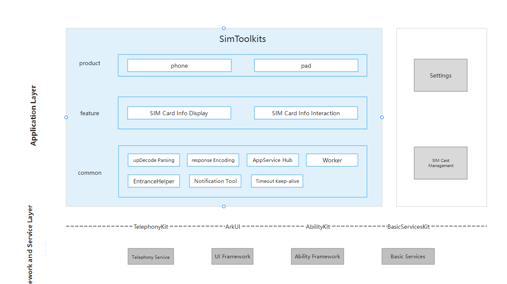

# SimToolKits 

## Introduction

SimToolKits (bundle name: `com.ohos.simtoolkits`) is a pre-installed **SIM Toolkit (STK)** system application in the OpenHarmony telephony subsystem. It parses and handles proactive commands issued by the SIM card, presents interactive UI such as menus, text, input fields, and confirmation dialogs, and returns the user action result to the Telephony framework as a Terminal Response or Envelope.

This is a pre-installed system application. It supports single-SIM, dual-SIM, and eSIM scenarios. It usually has no desktop icon; users can open the STK main menu from entries such as **Settings → Mobile network → SIM management**.

### Core Capabilities

**Information Display**

- Supports displaying SIM-issued text, idle mode text, or refresh prompts
- Supports playing notification tones, optionally with a text dialog
- Supports BIP confirmation / prompts and response
- Supports switching system language per SIM language notification

**Information Interaction**

- Supports main menu / submenu display, selection and response
- Supports single- / multi-character input and response
- Supports call-setup confirmation (accept / reject)
- Supports launching the system browser after confirmation
- Supports showing / hiding the STK entry in Settings

> **Note**: This repository is the STK **application layer**. Command parsing, session dispatch, and Terminal Response encoding live in the common layer (`AppService Hub` / `upDecode Parse` / `response Encode` / `Worker`). Modem / RIL performs SMS, SS, USSD, DTMF, and similar operations.

Event and call relationships:

1. After receiving a SIM proactive command, the Telephony framework starts this app's `ServiceExtAbility` via `startServiceExtensionAbility`, with `COMMON_EVENT_STK_*` action and parameters such as `msgCmd` and `slotId`.
2. After common-layer decoding and dispatch, the flow enters the matching feature: `Menu Mgmt` / `Text Display` / `Input UI` / `Call Confirm`, and so on.
3. After user interaction, the app returns Terminal Response / Envelope through TelephonyKit APIs; `Settings Entry` is coordinated with `com.ohos.settings` and `com.ohos.simcardmanagement`.

Example of a typical `SELECT_ITEM` (Menu Mgmt) flow:

- Telephony delivers the command HEX to `ServiceExtAbility`;
- `AppService Hub` decodes it via Worker / upDecode and starts `EntryAbility` to show the menu;
- After the user selects an item, response encoding returns the result via `sim.sendTerminalResponseCmd`.

## Architecture

SimToolKits uses a layered, modular design. Source code is organized by product form factor, feature capabilities, and common utilities, and works with the telephony subsystem, as shown below:




### Application Layer Design

The overall design can be divided into a product layer, a feature layer, and a common layer:

| Layer | Main directories / components | Description |
| ----- | ------------------------- | ----------- |
| Product | `application/`, `entryability/`, `ServiceExtAbility/` | AbilityStage, UIAbility, and ServiceExtensionAbility lifecycle and event ingress; phone and pad form factors |
| Feature | `pages/`, related Param / Helper classes | Information Display (Text Display, Play Tone, BIP Prompt, Lang Notify); Information Interaction (Menu Mgmt, Input UI, Call Confirm, Launch Browser, Settings Entry) |
| Common | `model/upDecode/`, `model/responseData/`, `common/`, `workers/` | upDecode Parse, response Encode, AppService Hub, Worker, EntranceHelper, Notification, Timeout/Keepalive |

Feature-layer modules:

| Core capability | Modules | Description |
| --------------- | ------- | ----------- |
| Menu Mgmt | Index, SetUpMenuParam, SelectItemParam (pages / upDecode) | Main-menu cache, submenu selection and response |
| Text Display | DisplayAndIdleTextHelper, NotificationUtils (helper / utils) | Dialog / Toast / notification, idle text |
| Input UI | SimToolKitInput, GetInkeyInputParam (pages / upDecode) | Single- / multi-character input and response |
| Call Confirm | LauncherDialog, SetUpCallParam (pages / upDecode) | Call-setup confirm, accept / reject |
| Launch Browser | LauncherDialog, LaunchBrowserParam (pages / upDecode) | Launch system browser after confirm |
| Play Tone | ToneDialog, TonePlayer, PlayToneParam (components / utils / upDecode) | Tone playback, optional text dialog |
| BIP Prompt | LauncherDialog, AllBipParam (pages / upDecode) | BIP confirm / prompt and response |
| Lang Notify | LanguageNotificationHelper, LanguageNotificationParam (upDecode) | Switch system language per SIM |
| Settings Entry | EntranceHelper, SettingsDataHelper (helper) | Show / hide STK entry in Settings search |

### Relationship with Other Applications

| Item | Description |
| ---- | ----------- |
| Can other apps call it? | Yes. `EntryAbility` / `ServiceExtAbility` declare `exported=true`; Telephony and other system components can start them via Want |
| Who can call it? | Primarily the Telephony framework starts `ServiceExtAbility` to deliver STK events; Settings / SIM management can launch the main menu with a `slotId` |
| When can it be called? | After the pre-installed app is available; actual STK work depends on proactive commands from the SIM |
| Supported Want parameters | `action` (`COMMON_EVENT_STK_*`), `msgCmd`, `slotId`, `pageUrl`, and so on (see `ServiceExtAbility` / `EntryAbility`) |
| Cross-process collaboration | Returns command results via TelephonyKit APIs; coordinates `Settings Entry` and dual-SIM launch with `com.ohos.settings` and `com.ohos.simcardmanagement` through Settings / RPC |

## Build

Source code is organized as product / feature / common layers inside a single `entry` module. The project is built with Hvigor and produces the `com.ohos.simtoolkits` (`SimToolkits.hap`) system application package.

### Environment Requirements

- OpenHarmony SDK (`compileSdkVersion` 23; `compatibleSdkVersion` / `targetSdkVersion` 20 in this project)
- DevEco Studio or the Hvigor command-line toolchain
- System signing certificates (see `signature/`)

### Build Commands

From the repository root:

```bash
# Open the project in DevEco Studio and build, or use the hvigor CLI
hvigorw assembleHap
```

## SimToolKits Development

SimToolKits is developed in ArkTS, with UI based on the ArkUI Stage model. The app receives STK events from Telephony through `ServiceExtAbility`, and `SimToolKitAppService` parses and dispatches them. Menu / input flows start `EntryAbility` to load `Index` or `SimToolKitInput`; confirm / Toast / tone flows are launched as `LauncherDialog` directly from `ServiceExtAbility`. See also: [ArkUI Development Overview](https://gitcode.com/openharmony/docs/blob/master/en/application-dev/ui/arkts-ui-development-overview.md)

### Developing on Existing Modules

Typical scenarios: customize existing capabilities, such as trimming or adjusting STK command handling, changing UI interaction, or updating Settings Entry logic.

Modifying or trimming existing modules

Locate the change by business boundary: `model/` (dispatch and codec), `pages/` (UI), `common/helper/` (entry / timeout / idle screen), or `workers/` (async parsing).

Modify the command parsing path:

For example, to adjust Param creation for a command type, change the corresponding branch in `UpDecodeFactory`:

```typescript
// model/upDecode/UpDecodeFactory.ets — create Param by commandType
private createUpParams(commandType: number): BaseUpParams | undefined {
  switch (commandType) {
    case CommandType.SET_UP_MENU:
      return new SetUpMenuParam();
    case CommandType.DISPLAY_TEXT:
      return new DisplayTextParam();
    // When adjusting an existing command, change the Param class or branch here
    default:
      return this.createUpParamsSecondary(commandType);
  }
}
```

Modify the command dispatch path:

For example, to adjust how `SELECT_ITEM` / input commands are started, extend `SimToolKitAppService`:

```typescript
// model/SimToolKitAppService.ets — handleUpParamData
switch (upParams.commandType) {
  case CommandType.DISPLAY_TEXT:
    DisplayAndIdleTextHelper.getInstance(slotId)?.parseDisplayText(upParams as DisplayTextParam);
    break;
  case CommandType.SELECT_ITEM:
    this.startInputOrMenuAbility(upParams.slotId, upParams, PageUrl.PAGE_URL_MAIN);
    break;
  case CommandType.GET_INPUT:
  case CommandType.GET_INKEY:
    this.startInputOrMenuAbility(upParams.slotId, upParams, PageUrl.PAGE_URL_INPUT);
    break;
  // When adjusting an existing command, change the branch logic here
}
```

Modify Settings Entry:

For example, to adjust entry refresh after `SET_UP_MENU`, change `EntranceHelper`:

```typescript
// common/helper/EntranceHelper.ets — refresh Settings entry after SET_UP_MENU
public async checkIsHaveMainMenu(
  context: common.ServiceExtensionContext | undefined,
  slotId: number
): Promise<void> {
  if (!context) {
    return;
  }
  let isHaveMainMenu =
    !CommonUtils.isEmptyObj(UpParamsCacheUtils.getInstance().getMainMenuParamsMemory(slotId));
  let key = this.getSettingDataKey(slotId);
  let value = this.getSaveSettingDataValue(slotId, isHaveMainMenu);
  await settings.setValue(context, key, value);
  // Then publish stk_entrance and RPC enableSearchItems / disableSearchItems
}
```

Modify UI components:

For example, to customize the main menu list, edit `pages/Index.ets`:

```typescript
// pages/Index.ets — main menu / SELECT_ITEM list
List() {
  ForEach(this.menuList, (item: ItemContent, index?: number) => {
    ListItem() {
      Flex({ alignItems: ItemAlign.Center, justifyContent: FlexAlign.SpaceBetween }) {
        // Extend here: custom icon, badge, secondary text, and so on
        Text(item.itemText)
          .fontSize($r('app.float.font_16'))
          .fontWeight(FontWeight.Medium)
        SymbolGlyph($r('sys.symbol.chevron_right'))
          .fontColor([$r('sys.color.icon_secondary')])
      }
      .onClick(() => {
        this.menuItemClick(item.itemId);
      })
    }
  })
}
```

1. - Command types: `entry/src/main/ets/common/constant/SimToolKitConstant.ts`
   - Param classes: `entry/src/main/ets/model/upDecode/`, created by `UpDecodeFactory`
   - Dispatch / session: `SimToolKitAppService`; response encoding: `model/responseData/`
2. - Menu page: `entry/src/main/ets/pages/Index.ets`
   - Input page: `entry/src/main/ets/pages/SimToolKitInput.ets`
   - Dialog page: `entry/src/main/ets/pages/LauncherDialog.ets`
3. - Settings Entry: `entry/src/main/ets/common/helper/EntranceHelper.ets`
   - Idle text / notification: `DisplayAndIdleTextHelper`, `NotificationUtils`
4. - Shared dialogs, navigation, and so on: `entry/src/main/ets/common/components/`

Common modification entry points:

| Target | Path |
| ------ | ---- |
| Menu / submenu | `entry/src/main/ets/pages/Index.ets` |
| GET_INKEY / GET_INPUT | `entry/src/main/ets/pages/SimToolKitInput.ets` |
| Confirm / Toast / tone | `entry/src/main/ets/pages/LauncherDialog.ets`, `common/components/` |
| Command hub | `entry/src/main/ets/model/SimToolKitAppService.ets` |
| Settings Entry | `entry/src/main/ets/common/helper/EntranceHelper.ets` |
| Shared dialogs / navigation | `entry/src/main/ets/common/components/` |

### Developing New Feature Capabilities

Typical scenarios: add support for a new proactive command, extend interaction forms, add differentiated capabilities, or adapt new device form factors.

Note: This project is a single `entry` HAP (`com.ohos.simtoolkits`). Product, feature, and common code live in the same module under different directories. New capabilities usually extend the existing layout; if product-form HAPs are split later, add the corresponding directories and register them in `build-profile.json5`.

Step 1: Extend business capabilities (most common)

1. Add the command type to `CommandType` in `SimToolKitConstant.ts` (skip if it already exists).
2. Add or extend the Param class under `model/upDecode/` and register it in `UpDecodeFactory`.
3. Add a dispatch branch in `SimToolKitAppService` (launch UI or auto-respond).
4. If a dedicated result is required, add Response / Envelope encoding under `model/responseData/`.
5. Add unit tests aligned with 3GPP TS 27.22 under `entry/src/ohosTest`, and register them in the test entry.

Step 2: Configure / confirm Ability entry points

Entries are already declared in `entry/src/main/module.json5`. When extending capabilities, usually confirm that permissions and Ability configuration cover the new scenario:

```json
{
  "module": {
    "name": "entry",
    "type": "entry",
    "srcEntry": "./ets/application/SimToolKitApplication.ets",
    "mainElement": "EntryAbility",
    "deviceTypes": [
      "default",
      "tablet"
    ],
    "abilities": [
      {
        "name": "EntryAbility",
        "srcEntry": "./ets/entryability/EntryAbility.ets",
        "exported": true,
        "launchType": "singleton"
      }
    ],
    "extensionAbilities": [
      {
        "name": "ServiceExtAbility",
        "srcEntry": "./ets/ServiceExtAbility/ServiceExtAbility.ets",
        "type": "service",
        "exported": true
      }
    ]
  }
}
```

Step 3: Customize UI

After business logic and Ability configuration are ready, extend the menu, input, or dialog pages using the UI modification approach in the previous section.

To add a new page:

1. Add the page file under `pages/`;
2. Register it in `resources/base/profile/main_pages.json` if system routing is required;
3. Add a `PageUrl` in `Constants.ts`, and start it from `SimToolKitAppService` / `EntryAbility` by command type.

## Directory

```text
simtoolkits
├─AppScope                              # App-level config and localization resources
│  ├─app.json5                          # bundleName, version, and so on
│  └─resources/                         # Global strings / icons
├─docs
│  └─figures/                           # Architecture diagrams
├─entry                                 # Single HAP module (product / feature / common)
│  └─src/main/
│     ├─ets/
│     │  ├─application/                 # AbilityStage
│     │  ├─entryability/                # EntryAbility (UI entry)
│     │  ├─ServiceExtAbility/           # ServiceExtensionAbility (event entry)
│     │  ├─pages/                       # Index / Input / LauncherDialog
│     │  ├─model/                       # Business hub, TLV parse, response encode
│     │  │  ├─upDecode/                 # Proactive command parsing
│     │  │  └─responseData/             # Terminal Response / Envelope
│     │  ├─common/
│     │  │  ├─components/               # Shared UI components
│     │  │  ├─constant/                 # Command types, TLV tags, response codes, page routes, timeouts, etc.
│     │  │  ├─helper/                   # Entry, timeout, idle-screen helpers
│     │  │  └─utils/                    # Notification, codec, cache, reporting
│     │  └─workers/                     # Async Worker parsing
│     ├─resources/                      # Module resources and localization
│     └─module.json5                    # Ability and permission declarations
├─hvigor                                # Build tool config
├─signature                             # Signing certificates and profiles
├─build-profile.json5                   # Project SDK / signing / product config
├─oh-package.json5
├─OAT.xml                               # Open-source compliance audit
├─LICENSE
├─README.md                             # Chinese documentation
└─README_en.md                          # English documentation
```

## Constraints

Language: ArkTS

Runtime form: pre-installed system application (`com.ohos.simtoolkits`), depending on TelephonyKit, notification, floating window, background task, and related system capabilities

Device types: `default`, `tablet` (see `entry/src/main/module.json5`)

Permissions: main permissions required by SimToolKits (see `entry/src/main/module.json5`)

| Permission | Grant mode | Usage |
| ---------- | ---------- | ----- |
| ohos.permission.SET_TELEPHONY_STATE | system | Return Terminal Response / Envelope; call-setup confirmation |
| ohos.permission.GET_TELEPHONY_STATE | system | Query SIM / call-related state |
| ohos.permission.KEEP_BACKGROUND_RUNNING | system | Keep background continuous task during STK sessions |
| ohos.permission.START_ABILITIES_FROM_BACKGROUND | system | Start menu / input / dialog Ability from background |
| ohos.permission.SYSTEM_FLOAT_WINDOW | system | Create floating windows / dialogs for STK UI |
| ohos.permission.ACCESS_NOTIFICATION_POLICY | system | Idle mode text, REFRESH, and related notifications |
| ohos.permission.MANAGE_SETTINGS / ACCESS_SYSTEM_SETTINGS | system | Read/write Settings; control Settings Entry show/hide |
| ohos.permission.UPDATE_CONFIGURATION | system | Language notification and configuration changes |
| ohos.permission.VIBRATE | system | Vibration for PLAY_TONE and similar cases |
| ohos.permission.PRIVACY_WINDOW | system | Privacy window for sensitive input |

Supported proactive commands: `SET_UP_MENU`, `SELECT_ITEM`, `DISPLAY_TEXT`, `GET_INKEY`, `GET_INPUT`, `SET_UP_IDLE_MODE_TEXT`, `PROVIDE_LOCAL_INFORMATION`, `SET_UP_CALL`, `LAUNCH_BROWSER`, `PLAY_TONE`, `SET_UP_EVENT_LIST`, `LANGUAGE_NOTIFICATION`, BIP-related commands, and so on (for some commands the app only shows Alpha ID prompts; execution is in RIL)

Form-factor notes: phone and tablet are both declared in `deviceTypes`; dual-SIM is isolated by `slotId` (0 / 1); eSIM combinations depend on system parameters; for secondary users (`localId ≠ 100`), commands other than `SET_UP_MENU` are rejected under the current policy

## Contributing

Contributions of code, documentation, and more are welcome. See [Contributing](https://gitcode.com/openharmony/docs/blob/master/en/contribute/contribution-process.md).

## Related Repositories

- [applications_simcardmanagement](https://gitcode.com/openharmony-sig/applications_simcardmanagement)（Simcardmanagement App）
- [applications_settings](https://gitcode.com/openharmony/applications_settings)（System Settings and Related External Pages）
