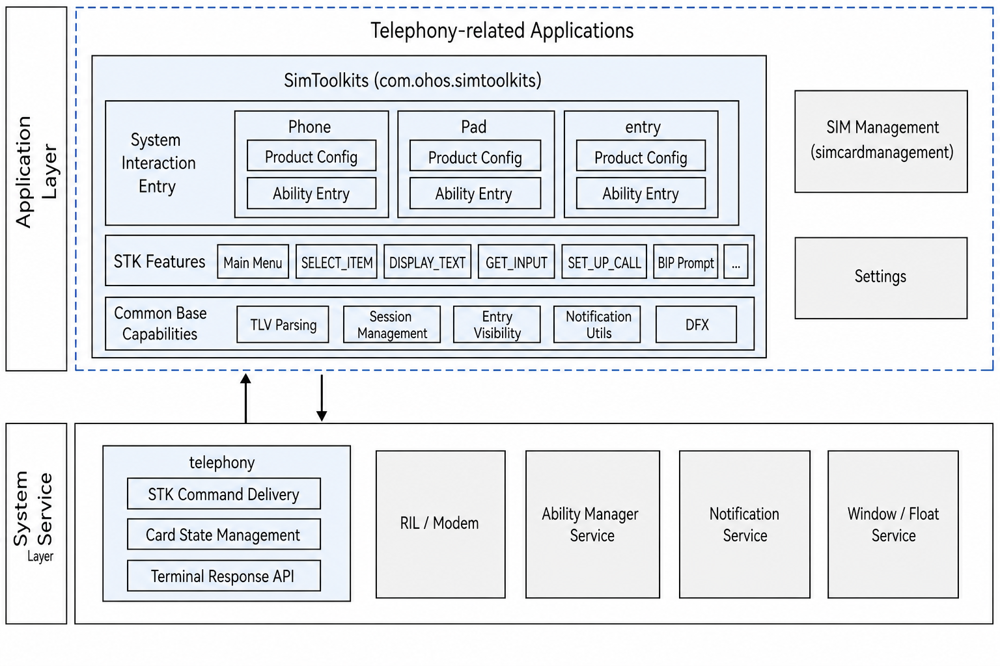
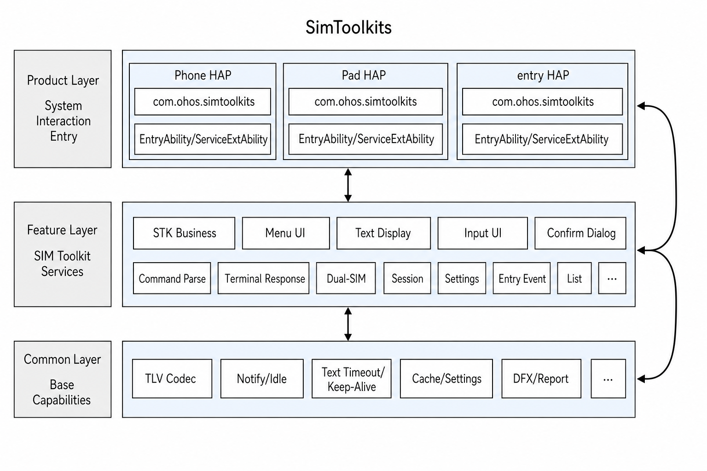
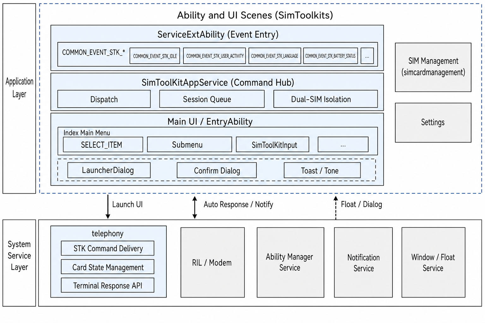
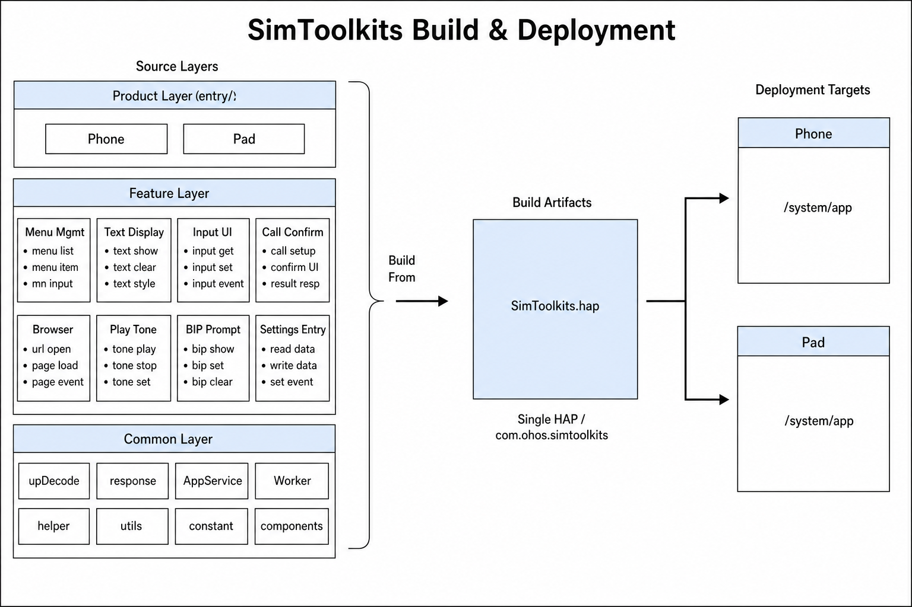

# SimToolkits

## Introduction
**SimToolkits** (bundle name: `com.ohos.simtoolkits`) is a **SIM Toolkit (STK)** system application in the OpenHarmony telephony subsystem. It parses and handles proactive commands issued by the SIM card, presents interactive UI such as menus, text, input fields, and confirmation dialogs, and returns the user action result to the Telephony framework as a Terminal Response or Envelope.

This is a pre-installed system application. It supports single-SIM, dual-SIM, and eSIM scenarios. It usually has no desktop icon; users can open the STK main menu from entries such as **Settings → Mobile network → SIM management**.

### Core Capabilities

**STK Command Parsing and Session Management**
- Receives STK common events from Telephony via `ServiceExtensionAbility` (command, session end, card state change, Alpha Identifier, and so on).
- Decodes HEX commands as BER-TLV on a Worker thread, then dispatches them by command type in `SimToolKitAppService`.
- Isolates session state by `slotId`, with command queues and timeout control for dual-SIM concurrency.

**User Interaction UI**
- Main menu / `SELECT_ITEM` list page (`Index`).
- `GET_INKEY` / `GET_INPUT` input page (`SimToolKitInput`).
- Unified dialogs for `DISPLAY_TEXT`, `SET_UP_CALL`, `LAUNCH_BROWSER`, `PLAY_TONE`, `OPEN_CHANNEL`, and so on (`LauncherDialog`).
- Idle mode text, REFRESH, and similar prompts via the notification bar.

**Settings Entry and Dual-SIM Management Integration**
- After `SET_UP_MENU`, writes Settings through `EntranceHelper` and publishes the `stk_entrance` event to show or hide the **SIM Toolkit** search item in Settings.
- Supports launching the main menu from `com.ohos.simcardmanagement` with a `slotId`.

**Terminal Response**
- Returns results via TelephonyKit APIs `sim.sendTerminalResponseCmd` / `sim.sendEnvelopeCmd`.
- For `SET_UP_CALL`, completes user confirmation via `sim.acceptCallSetupRequest` / `sim.rejectCallSetupRequest`.

> **Note**: This repository is the STK **application layer**. Modem / RIL performs SMS, SS, USSD, DTMF, and similar operations. For some commands (such as `SEND_SMS`, `SEND_SS`, `SEND_USSD`, `SEND_DTMF`, and `REFRESH`), this app mainly shows Alpha ID prompts; the Terminal Response is completed by the lower layers.

### Supported Proactive Commands

| Command | Type | Application-side handling |
| ---- | ------ | -------------- |
| SET_UP_MENU | 0x25 | Cache main menu, refresh Settings entry, return OK |
| SELECT_ITEM | 0x24 | Show submenu; return after user selection |
| DISPLAY_TEXT | 0x21 | Show text via dialog / Toast / notification |
| GET_INKEY | 0x22 | Single-character or Yes/No input |
| GET_INPUT | 0x23 | Text input |
| SET_UP_IDLE_MODE_TEXT | 0x28 | Idle mode text (notification bar) |
| PROVIDE_LOCAL_INFORMATION | 0x26 | Auto-return date/time, language, and related info |
| SEND_SMS / SEND_SS / SEND_USSD / SEND_DTMF | 0x13 / 0x11 / 0x12 / 0x14 | Alpha ID Toast (execution in RIL) |
| REFRESH | 0x01 | Notification prompt (execution in RIL) |
| SET_UP_CALL | 0x10 | Accept / reject call setup after confirmation dialog |
| LAUNCH_BROWSER | 0x15 | Launch browser after confirmation |
| PLAY_TONE | 0x20 | Play tone; optional text dialog |
| SET_UP_EVENT_LIST | 0x05 | Register idle screen, user activity, language events |
| LANGUAGE_NOTIFICATION | 0x35 | Switch system language |
| OPEN_CHANNEL / CLOSE_CHANNEL / RECEIVE_DATA / SEND_DATA / GET_CHANNEL_STATUS | 0x40–0x44 | BIP-related (app mainly confirms / prompts) |

### Relationship Between SimToolKits and Telephony

SimToolKits depends on the telephony subsystem (Telephony / RIL) and does not include a modem protocol stack.

**Events and call relationships**:
1. After receiving a SIM proactive command, the Telephony framework starts this app's `ServiceExtAbility` via `startServiceExtensionAbility`, with `COMMON_EVENT_STK_*` action and parameters such as `msgCmd` and `slotId`.
2. After parsing and UI interaction, this app returns Terminal Response / Envelope through TelephonyKit APIs.
3. Settings entry visibility is coordinated with `com.ohos.settings` and `com.ohos.simcardmanagement`.

> Example of a typical `SELECT_ITEM` flow:
> - Telephony delivers the command HEX to `ServiceExtAbility`;
> - `SimToolKitAppService` decodes it via Worker and starts `EntryAbility` to show the menu;
> - After the user selects an item, the app encodes Envelope / Terminal Response and calls `sim.sendTerminalResponseCmd`.

## Architecture

SimToolKits uses a layered, modular design and works with the telephony subsystem.

### Position in the System

SimToolKits sits in the application layer. It relies on Telephony / RIL to deliver proactive commands and receive Terminal Responses, and works with Settings and SIM management to control entry visibility and dual-SIM launch.



### Layered Design

The overall design can be divided into a product layer (Ability entry), a feature layer (STK business capabilities), and a common layer (codec / utilities), as shown below:



| Layer | Main directories / components | Description |
| ---- | --------------- | ---- |
| Product / application entry | `application/`, `entryability/`, `ServiceExtAbility/` | AbilityStage, UIAbility, and ServiceExtensionAbility lifecycle and event intake |
| Feature / STK business | `pages/`, `model/SimToolKitAppService.ets`, and so on | Menu, input, and dialog UI; command dispatch, session queues, dual-SIM isolation |
| Common / base capabilities | `model/upDecode/`, `model/responseData/`, `common/`, `workers/` | TLV codec, response encoding, entry visibility, notifications, timeout, cache, reporting |

### Ability and UI Scenes

Events enter through `ServiceExtAbility`, are dispatched by `SimToolKitAppService`, then launch menu / input / dialog UI, or follow notification and auto-response paths:



**Data flow overview**:

```text
SIM / Modem
  → Telephony / RIL
  → ServiceExtAbility (COMMON_EVENT_STK_*)
  → SimToolKitAppService
  → WorkerManager + UpDecodeFactory
  → UI (Index / Input / LauncherDialog) or auto-response
  → SimToolKitResponseManager
  → sim.sendTerminalResponseCmd / sendEnvelopeCmd
```

### Component and External Dependencies

Internally the component is organized by product / feature / common capabilities. Cross-process collaboration uses TelephonyKit APIs, Settings, and SIM management:


### Module Description

| Module | Path | Description |
| ---- | ---- | ---- |
| AbilityStage | entry/src/main/ets/application/ | App-level lifecycle; listens for language / theme / font scale changes |
| EntryAbility | entry/src/main/ets/entryability/ | UI entry; loads menu / input pages; checks SIM state and main menu |
| ServiceExtAbility | entry/src/main/ets/ServiceExtAbility/ | Background service; receives STK events and creates float windows / dialogs |
| Command hub | entry/src/main/ets/model/SimToolKitAppService.ets | Core singleton for session and command dispatch |
| Response manager | entry/src/main/ets/model/SimToolKitResponseManager.ets | Sends Terminal Response / Envelope |
| TLV parsing | entry/src/main/ets/model/upDecode/ | Command Param classes and UpDecodeFactory |
| Response encoding | entry/src/main/ets/model/responseData/ | Default / Input / SelectItem / BIP / Envelope, and so on |
| Worker | entry/src/main/ets/workers/ | Asynchronous STK HEX command parsing |
| Pages | entry/src/main/ets/pages/ | Index, SimToolKitInput, LauncherDialog |
| Common components | entry/src/main/ets/common/components/ | NavBack, ToastDialog, ToneDialog |
| Helpers | entry/src/main/ets/common/helper/ | Entry, timeout, idle screen, event list, Settings, and so on |
| Utilities | entry/src/main/ets/common/utils/ | UI, notification, encoding, cache, reporting, background keep-alive, and so on |
| Constants | entry/src/main/ets/common/constant/ | Command types, response codes, timeouts, SlotId, and so on |

## Build

Source code is organized as Product / Feature / Common layers, all inside a single `entry` module. The build produces one `SimToolkits.hap`, which is deployed to `/system/app` on the device. This project does not split or introduce HAR packages.



Delivery is a single `entry` HAP (`com.ohos.simtoolkits` / `SimToolkits.hap`). The left-side layers in the diagram only describe source responsibility boundaries; the only build artifact is the HAP.

### Environment Requirements
- OpenHarmony  SDK (this project uses `compileSdkVersion` 23, and `compatibleSdkVersion` / `targetSdkVersion` 20)
- DevEco Studio or the Hvigor command-line toolchain
- System signing certificates (see `signature/`)

### Build Commands

Run from the project root:

```bash
# Open the project in DevEco Studio and build, or use the hvigor CLI
hvigorw assembleHap
```

When integrated into the OpenHarmony source tree as a system component, follow the platform unified build flow and package this app as a pre-installed system application in the image.

### System Integration Configuration

Image integration usually also requires the following (example files are at the project root):

| File | Description |
| ---- | ---- |
| install_list_permissions.json | Pre-grants permissions such as `SET_TELEPHONY_STATE` and `MANAGE_SECURE_SETTINGS` to `com.ohos.simtoolkits` |
| install_list_capability.json | Declares system capabilities such as `allowAppDesktopIconHide` and `allowAppUsePrivilegeExtension` |

> The install_list configuration must be maintained together with the system permission / capability allowlist repositories. The merge target follows the product integration rules.

## Developing SimToolKits

SimToolKits is developed in **ArkTS**, with UI based on the ArkUI Stage model. Telephony starts `ServiceExtAbility` via Want to deliver STK commands (command, session end, card state change, and so on), which `SimToolKitAppService` parses and dispatches. Menu / input interaction launches `EntryAbility` to load `Index` and `SimToolKitInput`; confirm / Toast / tone dialogs are shown by `ServiceExtAbility` directly via `LauncherDialog`; idle-mode text and REFRESH use the notification bar. See: [ArkUI Development Overview](https://gitcode.com/openharmony/docs/blob/master/en/application-dev/ui/arkts-ui-development-overview.md)

### Development Based on Existing Modules

Typical scenarios: customize existing capabilities, such as trimming or adjusting STK command handling, modifying UI interaction, or changing Settings entry visibility.

**Adjusting or trimming existing modules**

1. Locate the change by business boundary: `model/` (command dispatch and codec), `pages/` (UI), `common/helper/` (entry / timeout / idle screen), or `workers/` (async parsing).
2. When adjusting command handling:
    - Command types are defined in `CommandType` under `entry/src/main/ets/common/constant/SimToolKitConstant.ts`.
    - Parsers live in `entry/src/main/ets/model/upDecode/` and are created by `UpDecodeFactory`.
    - Dispatch and session logic live in `SimToolKitAppService`; response encoding lives in `model/responseData/`.

Example: inspect / adjust command types and parser registration:

```typescript
// common/constant/SimToolKitConstant.ts
export enum CommandType {
  SET_UP_MENU = 0x25,
  DISPLAY_TEXT = 0x21,
  SELECT_ITEM = 0x24,
  // ...
}

// model/upDecode/UpDecodeFactory.ets — create Param by commandType
private createUpParams(commandType: number): BaseUpParams | undefined {
  switch (commandType) {
    case CommandType.SET_UP_MENU:
      return new SetUpMenuParam();
    case CommandType.DISPLAY_TEXT:
      return new DisplayTextParam();
    // When adjusting an existing command, change the Param class or branch here
    default:
      return this.createUpParamsSecondary(commandType);
  }
}
```

Example: dispatch by command type in the command hub:

```typescript
// model/SimToolKitAppService.ets — handleUpParamData / handleUpParamDataSecondary
switch (upParams.commandType) {
  case CommandType.DISPLAY_TEXT:
    DisplayAndIdleTextHelper.getInstance(slotId)?.parseDisplayText(upParams as DisplayTextParam);
    break;
  case CommandType.SELECT_ITEM:
    this.startInputOrMenuAbility(upParams.slotId, upParams, PageUrl.PAGE_URL_MAIN);
    break;
  case CommandType.GET_INPUT:
  case CommandType.GET_INKEY:
    this.startInputOrMenuAbility(upParams.slotId, upParams, PageUrl.PAGE_URL_INPUT);
    break;
  // When adjusting an existing command, update the matching branch
}
```

3. When trimming a command type:
    - First remove the corresponding branches in `UpDecodeFactory` / `SimToolKitAppService`;
    - Then clean up related Param / Response classes and tests to avoid leftover calls.

Example: trim `PLAY_TONE` (illustrative):

```typescript
// UpDecodeFactory.createUpParams — remove or comment out the case
// case CommandType.PLAY_TONE:
//   result = new PlayToneParam();
//   break;

// SimToolKitAppService.handleUpParamDataSecondary — remove the branch
// case CommandType.PLAY_TONE:
//   this.parsePlayTone(upParams as PlayToneParam);
//   break;

// Also delete PlayToneParam / related Response encoding and ohosTest cases
```

**Modifying existing UI**

Example of customizing STK interaction UI:
- The event entry is `ServiceExtAbility`; the UI main entry is `EntryAbility`; dialogs are launched by `ServiceExtAbility` via `LauncherDialog`.
- Main menu / submenu is hosted by `pages/Index.ets`; input commands by `pages/SimToolKitInput.ets`; confirm / Toast / tone by `pages/LauncherDialog.ets` and `common/components/`.
- During development, extend components in existing pages, or add new display branches by command type.

**Example: customize the main menu list (`Index`)**

You can add custom titles, icons, or click logic where menu items are rendered:

```typescript
// pages/Index.ets — main menu / SELECT_ITEM list
build() {
  Column() {
    NavBack({
      headName: this.title,
      menuItems: $menuItems,
      isShowMenu: $isShowMenu,
      callBack: (type: NavCallBackType) => {
        this.toolBarClick(type);
      }
    })
    List() {
      ForEach(this.menuList, (item: ItemContent, index?: number) => {
        ListItem() {
          Flex({ alignItems: ItemAlign.Center, justifyContent: FlexAlign.SpaceBetween }) {
            // Extend here: custom icon, badge, secondary text, and so on
            Text(item.itemText)
              .fontSize($r('app.float.font_16'))
              .fontWeight(FontWeight.Medium)
            SymbolGlyph($r('sys.symbol.chevron_right'))
              .fontColor([$r('sys.color.icon_secondary')])
          }
          .onClick(() => {
            // Default: return menu selection; insert custom pre-logic here if needed
            this.menuItemClick(item.itemId);
          })
        }
      })
    }
  }
}
```

**Example: customize dialog composition (`LauncherDialog`)**

Choose confirm / Toast / Tone by command type, and optionally insert custom content:

```typescript
// pages/LauncherDialog.ets — compose existing components by dialog type
@Entry
@Component
struct LauncherDialog {
  @State private title: string = '';
  @State private content: string = '';
  private curDialog?: CustomDialogController;
  private curDialogType: string = '';

  private createConfirmDialogController(): CustomDialogController {
    return new CustomDialogController({
      builder: AlertDialog({
        primaryTitle: this.title,
        content: this.content,
        primaryButton: {
          value: $r('app.string.cancel'),
          action: () => {
            this.onEvent?.(UIResponseCode.RESPONSE_TYPE_CONFIRM_REJECT);
          }
        },
        secondaryButton: {
          value: $r('app.string.confirm'),
          action: () => {
            this.onEvent?.(UIResponseCode.RESPONSE_TYPE_CONFIRM_OK);
          }
        }
      })
    });
  }

  build() {
    // Branch by curDialogType:
    // dialog_type_confirm → AlertDialog / confirm
    // dialog_type_toast   → ToastDialog
    // dialog_type_tone    → ToneDialog
    // You can also insert CustomDialogContent(...) for product customization
  }
}
```

**Example: customize the input page (`SimToolKitInput`)**

Validation, default text, and Yes/No layout for `GET_INKEY` / `GET_INPUT` can be adjusted on this page; after confirm, results are returned via `SimToolKitAppService.handleCmdResponse`.

```typescript
// pages/SimToolKitInput.ets — return result after user confirm / cancel
private handleCommandResponse(isConfirm: boolean, input: string, isHelper: boolean): void {
  let inputResponseData = new UiInputResponseData(isConfirm, input, isHelper);
  SimToolKitAppService.getInstance().handleCmdResponse(
    FromPageFlag.TYPE_INPUT,
    UIResponseCode.RESPONSE_TYPE_INPUT,
    this.inkeyInputParam,
    undefined,
    inputResponseData
  );
}

private buttonClick(isConfirm: boolean, input: string): void {
  if (this.status === InkeyInputStatus.STATE_TEXT) {
    if (isConfirm) {
      // Insert here: custom length checks, masking, default-text rewrite, and so on
      this.handleCommandResponse(true, input, false);
    } else {
      SimToolKitAppService.getInstance().handleCmdResponse(
        FromPageFlag.TYPE_INPUT,
        UIResponseCode.RESPONSE_TYPE_END_SESSION,
        this.inkeyInputParam
      );
    }
  } else {
    // Yes / No mode
    this.handleCommandResponse(isConfirm, '', false);
  }
}
```

Common modification entry points:

| Target | Path |
| ---- | ---- |
| Menu / submenu | `pages/Index.ets` |
| GET_INKEY / GET_INPUT | `pages/SimToolKitInput.ets` |
| Confirm / Toast / tone | `pages/LauncherDialog.ets`, `common/components/` |
| Settings entry visibility | `common/helper/EntranceHelper.ets` |

Settings entry control is centralized in `EntranceHelper`:
- Writes different `stk_entrance*` Settings keys for single-SIM / dual-SIM / eSIM combinations;
- Enables or disables search items via RPC to `SettingsExtService` of `com.ohos.settings`.

```typescript
// common/helper/EntranceHelper.ets — refresh Settings entry after SET_UP_MENU
public async checkIsHaveMainMenu(
  context: common.ServiceExtensionContext | undefined,
  slotId: number
): Promise<void> {
  if (!context) {
    return;
  }
  // Show entry when main-menu cache exists; otherwise hide
  let isHaveMainMenu =
    !CommonUtils.isEmptyObj(UpParamsCacheUtils.getInstance().getMainMenuParamsMemory(slotId));
  let key = this.getSettingDataKey(slotId);           // stk_entrance / stk_entrance_0 ...
  let value = this.getSaveSettingDataValue(slotId, isHaveMainMenu); // '0' hide / '1'|'2'|'31' show
  await settings.setValue(context, key, value);
  // Then publish the stk_entrance event and RPC enableSearchItems / disableSearchItems
}
```

### Developing New Features or Command Capabilities

Typical scenarios: add support for a new proactive command, extend device form factors, or add differentiated interaction capabilities.

> **Note**: This project is currently a single `entry` HAP (`com.ohos.simtoolkits`), unlike SceneBoard which splits Phone/Pad/PC into multiple product HAPs. New capabilities are usually extended inside the existing HAP. If product form factors are split later, follow this section to add a new HAP.

**Step 1: Extend command parsing and dispatch (most common)**

1. Add the command type to `CommandType` in `SimToolKitConstant.ts` (skip if it already exists).

```typescript
// common/constant/SimToolKitConstant.ts
export enum CommandType {
  // ... existing commands
  CUSTOM_CMD = 0xXX, // new command type value (per 3GPP / product spec)
}
```

2. Add or extend the corresponding Param parser under `model/upDecode/`, and register it in `UpDecodeFactory`.

```typescript
// model/upDecode/CustomCmdParam.ets — new parser (illustrative)
export class CustomCmdParam extends BaseUpParams {
  public text: string = '';

  public processMsgList(tlvList: Array<Tlv>): void {
    super.processMsgList(tlvList);
    if (this.parseResultCode === ResponseCode.OK) {
      let parseText = DecodeItemUtil.parseTextString(tlvList).data;
      if (parseText === undefined) {
        this.parseResultCode = ResponseCode.CMD_DATA_NOT_UNDERSTOOD;
      } else {
        this.text = parseText;
      }
    }
  }
}

// model/upDecode/UpDecodeFactory.ets — register
case CommandType.CUSTOM_CMD:
  result = new CustomCmdParam();
  break;
```

3. Add a dispatch branch in `SimToolKitAppService` (launch UI or auto-response).

```typescript
// model/SimToolKitAppService.ets
case CommandType.CUSTOM_CMD:
  // Needs user interaction: launch menu / input / dialog page
  this.startInputOrMenuAbility(upParams.slotId, upParams, PageUrl.PAGE_URL_DIALOG);
  // Or no interaction: showToast / send Terminal Response, then pull next command
  break;
```

4. If a dedicated result is needed, add Response / Envelope encoding under `model/responseData/`.

```typescript
// model/responseData/terminalResponseData/CustomCmdResponseData.ets — illustrative
export class CustomCmdResponseData extends DefaultResponseData {
  // Append dedicated TLV fields in getCmdDetail() / encode methods
  // Finally SimToolKitResponseManager calls
  // sim.sendTerminalResponseCmd(slotId, responseHex)
}
```

5. Add unit tests under `entry/src/ohosTest` aligned with 3GPP TS 27.22 for parsing and response.

```typescript
// entry/src/ohosTest/.../CustomCmd.test.ets — illustrative
it('CustomCmd_parse', 0, async (done: Function) => {
  const HEX = 'D0...'; // standard or vendor-provided command HEX
  let upParam = UpDecodeFactory.getInstance().parseUpData(HEX, 0);
  expect(upParam?.commandType).assertEqual(CommandType.CUSTOM_CMD);
  expect((upParam as CustomCmdParam)?.text).assertEqual('expected');
  done();
});
```

**Step 2: Configure / verify Ability entry**

The project entry is already declared in `entry/src/main/module.json5`. When extending capabilities, usually only verify that permissions and Ability config meet the new scenario:

```json
{
  "module": {
    "name": "entry",
    "type": "entry",
    "srcEntry": "./ets/application/SimToolKitApplication.ets",
    "mainElement": "EntryAbility",
    "deviceTypes": [
      "default",
      "tablet"
    ],
    "abilities": [
      {
        "name": "EntryAbility",
        "srcEntry": "./ets/entryability/EntryAbility.ets",
        "exported": true,
        "launchType": "singleton"
      }
    ],
    "extensionAbilities": [
      {
        "name": "ServiceExtAbility",
        "srcEntry": "./ets/ServiceExtAbility/ServiceExtAbility.ets",
        "type": "service",
        "exported": true
      }
    ]
  }
}
```

Typical event entry handling (`ServiceExtAbility`):

```typescript
// ServiceExtAbility: receive STK events from Telephony
export default class ServiceExtAbility extends ServiceExtensionAbility {
  onCreate(want: Want): void {
    SimToolKitAppService.getInstance().setServiceContext(this.context);
  }

  onRequest(want: Want, startId: number): void {
    // Launch dialog if needed
    // this.checkIsShowDialog(want);
    // Dispatch to the command hub
    if (want?.action) {
      SimToolKitAppService.getInstance().callBackFromService(want.parameters, want.action);
    }
  }
}
```

**Step 3: Customize UI**

After command parsing and Ability configuration are ready, extend `Index` / `SimToolKitInput` / `LauncherDialog` as described in the previous section.

To add a standalone page:
1. Add the page file under `pages/`, for example `pages/CustomStkPage.ets`;

```typescript
// pages/CustomStkPage.ets — new page skeleton (illustrative)
@Entry
@Component
struct CustomStkPage {
  @State private title: string = '';
  @State private content: string = '';

  aboutToAppear() {
    // Read the current command Param from AppStorage / LocalStorage and render
  }

  build() {
    Column() {
      Text(this.title)
      Text(this.content)
      Button($r('app.string.confirm'))
        .onClick(() => {
          SimToolKitAppService.getInstance().handleCmdResponse(
            FromPageFlag.TYPE_DIALOG,
            UIResponseCode.RESPONSE_TYPE_CONFIRM_OK
          );
        })
    }
  }
}
```

2. Register it in `resources/base/profile/main_pages.json`:

```json
{
  "src": [
    "pages/Index",
    "pages/SimToolKitInput",
    "pages/LauncherDialog",
    "pages/CustomStkPage"
  ]
}
```

3. Add `PageUrl` in `Constants.ts`, then launch by command type from `SimToolKitAppService` / `EntryAbility`:

```typescript
// common/constant/Constants.ts
export enum PageUrl {
  PAGE_URL_INPUT = 'pages/SimToolKitInput',
  PAGE_URL_MAIN = 'pages/Index',
  PAGE_URL_DIALOG = 'pages/LauncherDialog',
  PAGE_URL_CUSTOM = 'pages/CustomStkPage', // new
}

// model/SimToolKitAppService.ets — set pageUrl when dispatching
case CommandType.CUSTOM_CMD:
  this.startInputOrMenuAbility(upParams.slotId, upParams, PageUrl.PAGE_URL_CUSTOM);
  break;

// entryability/EntryAbility.ets — load by want.parameters.pageUrl
private getPageUrl(want: Want): string {
  if (!want.parameters?.pageUrl || (typeof want.parameters?.pageUrl) !== 'string') {
    return PageUrl.PAGE_URL_MAIN;
  }
  return want.parameters.pageUrl as string;
}
```

## Directory
```text
simtoolkits
├─AppScope                              # App-level config and multi-language resources
│  ├─app.json5                          # bundleName, version, and so on
│  └─resources/                         # Global string resources
├─docs
│  └─figures/                           # Architecture diagrams
│     ├─simtoolkits_in_os.png           # Position in the system (zh)
│     ├─simtoolkits_architecture.png    # Layered architecture (zh)
│     ├─simtoolkits_ability.png         # Ability and UI scenes (zh)
│     ├─simtoolkits_ipc.png             # Component and external dependencies (zh)
│     ├─simtoolkits_build.png           # Build and deployment (zh)
│     ├─simtoolkits_in_os_en.png        # Position in the system (en)
│     ├─simtoolkits_architecture_en.png # Layered architecture (en)
│     ├─simtoolkits_ability_en.png      # Ability and UI scenes (en)
│     ├─simtoolkits_ipc_en.png          # Component and external dependencies (en)
│     └─simtoolkits_build_en.png        # Build and deployment (en)
├─entry                                 # Sole HAP module
│  ├─src/main/
│  │  ├─ets/
│  │  │  ├─application/                 # AbilityStage
│  │  │  ├─entryability/                # EntryAbility (UI entry)
│  │  │  ├─ServiceExtAbility/           # ServiceExtensionAbility (event entry)
│  │  │  ├─model/                       # Business hub, TLV parsing, response encoding
│  │  │  │  ├─upDecode/                 # Proactive command parsing
│  │  │  │  └─responseData/             # Terminal Response / Envelope
│  │  │  ├─pages/                       # Index / Input / LauncherDialog
│  │  │  ├─common/
│  │  │  │  ├─components/               # Common UI components
│  │  │  │  ├─constant/                 # Command types and constants
│  │  │  │  ├─helper/                   # Entry, timeout, idle screen helpers
│  │  │  │  └─utils/                    # Utility classes
│  │  │  └─workers/                     # Worker async parsing
│  │  ├─resources/                      # Module resources, multi-language, dark mode
│  │  └─module.json5                    # Ability and permission declarations
│  ├─src/mock/                          # Unit test mocks (telephony.sim, and so on)
│  ├─src/ohosTest/                      # Hypium automated tests
│  ├─build-profile.json5
│  └─obfuscation-rules.txt
├─hvigor                                # Build tool config
├─signature                             # Signing certificates and profile
├─install_list_capability.json          # Example system capability allowlist
├─install_list_permissions.json         # Example system pre-granted permissions
├─build-profile.json5                   # Project-level SDK / signing / product config
├─oh-package.json5
├─OAT.xml                               # Open-source compliance audit
├─LICENSE
├─README.md
└─README_en.md
```

## Constraints
- Language: ArkTS
- Runtime form: pre-installed system app (`com.ohos.simtoolkits`), depends on TelephonyKit and privileged system permissions
- Device types: `default`, `tablet` (see `module.json5`)
- Dual-SIM: isolated by `slotId` (0 / 1); eSIM combinations depend on system parameters `const.ril.esim_type` and `persist.ril.sim_switch`
- Sub-user: for non-primary OS accounts (`localId ≠ 100`), commands other than `SET_UP_MENU` are rejected under the current policy
- This repository does not include RIL / Modem source; it does not subscribe to STK broadcasts directly and relies on Telephony to start `ServiceExtAbility`

## Contribution

Contributions of code, documentation, and more are welcome. For the contribution process, see [Contribute](https://gitcode.com/openharmony/docs/blob/master/en/contribute/contribution.md).

## Related Repositories
- [telephony_core_service](https://gitcode.com/openharmony/telephony_core_service) (Telephony core service; adjust the link to the actual integration repo)
- [telephony_ril_adapter](https://gitcode.com/openharmony/telephony_ril_adapter) (RIL adapter; adjust the link to the actual integration repo)
- Settings / SIM management system apps (`com.ohos.settings`, `com.ohos.simcardmanagement`)
